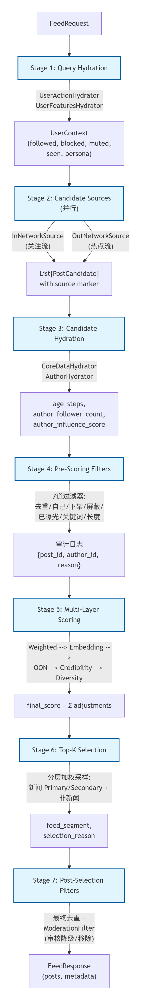

# EvoSim 舆情生态系统仿真

# 舆论生态位竞争与演替理论

## 竞争排斥原理（高斯定律）

两个物种如果生态位完全相同，它们就不能在同一稳定环境中长期共存。

反过来讲，如果一个生态位被硬生生抽空（比如由于环境灾难或人为灭绝），必定会有新的、繁殖力更强的物种迅速填补这个真空。

## **舆论生态位**

在舆情系统中，一个“生态位”并不是简单的某个话题（比如“环保”），而是由以下三个维度构成的多维空间：

- **情感维度：** 焦虑、愤怒、同情、狂热。
- **认知维度：** 阴谋论叙事、精英批判叙事、弱者受害叙事。
- **受众资源：** 特定的目标用户群体及其算法分发权重。

**恶意水军的生存法则：** 它们就像生态系统中的“入侵物种（如水葫芦）”，它们不产生高质量内容，而是通过廉价、高频地生产极其契合特定极端情绪的言论，来**掠夺用户注意力（系统资源）**，骗取推荐算法（阳光与雨露）的流量倾斜。

## **传统治理的痛点：“生态真空”与“野火效应”**

传统的事后干预（封停账号、删帖）相当于*喷洒除草剂”

- **真空困境：** 你封禁了水军账号，等于强行清除了占据该生态位的物种。但是，**关注这些账号的普通用户的“情感需求”和“认知偏见”并没有消失。**
- **野火效应/ 劣币驱逐良币：** 这片“生态真空”极其肥沃。由于没有理性的声音去填补，新的水军矩阵或更极端的阴谋论真人用户会迅速涌入。甚至因为平台打压，他们会演化出更隐蔽、更具对抗性的变种语言（黑话、隐喻），导致生态进一步恶化。

## **EvoCorps 主动防御系统：生态演替与竞争性驱逐**

EvoCorps 扮演的是“引入天敌”或“种植固沙植物”的角色，实现“生态位竞争”。

防御 Agent 的行动可以分为三个阶段：

### **阶段一：防御性占位**

- 在敏感话题爆发初期或恶意水军尚未形成规模时，EvoCorps 的 Agent（如：共情者、科普大V）主动介入。
- **策略：** 提供既能疏导该群体特定情绪（如适当的焦虑或不满），又坚守事实底线的叙事。通过占据用户的注意力，抢占该生态位。
- **效果：** 减少了算法留给恶意水军的曝光资源，提高水军“入侵”的算法成本。这在心理学上称为“态度免疫”。

### **阶段二：算法资源争夺**

- 当恶意水军已经占据了生态位并开始极化普通用户时。
- **策略：** EvoCorps Agent 必须进化出比干巴巴的官方通报“更有网感、更有同理心”的话术（这就是 Agent 进化的意义）。它们不能只在对面阵营对骂，而是要产出能吸引中间派点赞、转发的内容。
- **效果：** 在 X 这种注意力零和博弈的算法下，EvoCorps 在该话题下抢走的每一个 Like 和 Share，都意味着水军帖子在 Heavy Ranker 中的权重被稀释。我们通过**“争夺算法资源”来饿死水军**，而不是靠硬编码封禁。
    
    > 引入真实推荐算法的目的, 让我们策略更有针对性且更真实
    > 

### **阶段三：生态演替填补**

- 当平台巡查机制（或系统模拟的平台方）终于落下，**封禁了头部恶意水军账号时，EvoCorps 必须在 下个时间步 可以启动。**
- **策略：** 原本水军的“粉丝”（那些被极化洗脑的普通用户）突然发现意见领袖消失了，会产生迷茫、逆反甚至受害者心态（认为平台在压迫真相）。此时，EvoCorps 中的 **“安抚者” Agent** 精准切入。
- **话术范例：** 不去嘲讽“你们被骗了”，而是说：“刚才那个账号因为过度偏激被处理了，但我理解大家对 XX 问题的担忧，其实事情的另一面是…”
- **效果：** 无缝接管“流失流量”，提供心理缓冲软着陆，彻底封闭该生态位，完成从“杂草丛生（水军）”到“良性群落（EvoCorps）”的生态演替。

# 舆论生态位功能架构与元素定义

**目标:**  为打造真正的‘数字社会风洞’与舆情治理仿真工具，EvoCorps 将系统内每个元素视为生态节点，构建起一个由四类彼此依存、对抗与演化的核心实体所组成的舆论生态系统。

**设计原则:**  全模块可插拔

### 平台方

平台方定义了信息的传播规则和干预手段

- **X 真实推荐算法 (简化版) [可开关]**
    - **职责:** 决定谁能看到什么信息，是划分“生态位”的核心机制。
    - **功能:**
        - **重排优先:** 基于互动率（点赞、转发、评论）给帖子打分。
        - **网络拓扑:** 区分 In-Network (关注流) 和 Out-Network (发现流)。
        - **时间减:** 仿真信息的热度半衰期。
        
        > 反正 [X算法代码](https://github.com/xai-org/x-algorithm) 开源的
        > 
    - **流程介绍**
        
        ## 推荐算法 7 阶段流程
        
        ### Stage 1: Query Hydration (查询补全)
        
        **位置**: feed_pipeline.py:387-391
        
        **目的**: 获取用户上下文信息
        
        **组件**:
        
        | 组件 | 功能 | 数据源 |
        | --- | --- | --- |
        | `UserActionHydrator` | 并行获取用户社交图谱 | `UserRepository` |
        | `UserFeaturesHydrator` | 获取用户画像与 Embedding | `UserRepository` |
        
        **填充数据**:
        
        `UserContext:
          - followed_ids: Set[str]      # 关注列表
          - blocked_ids: Set[str]       # 屏蔽列表  
          - muted_keywords: List[str]   # 静音关键词
          - seen_post_ids: Set[str]     # 已曝光帖子
          - persona: str                # 用户画像
          - persona_embedding: List[float]  # 画像向量`
        
        **优化**: 支持 5 路并行查询，减少 I/O 延迟
        
        ### Stage 2: Candidate Sources (双轨召回)
        
        **位置**: feed_pipeline.py:393-441
        
        **目的**: 从两个来源召回候选帖子
        
        | 来源 | 组件 | 对应 X 算法 | 功能 |
        | --- | --- | --- | --- |
        | **In-Network** | `InNetworkSource` | Thunder | 关注流召回，维系信息茧房 |
        | **Out-Network** | `OutNetworkSource` | Phoenix Retrieval | 热点流召回，打破信息茧房 |
        
        **配额分配**:
        
        `# 归一化 ratio 并计算配额
        in_ratio = in_network_ratio / (in_network_ratio + out_network_ratio)
        in_target = round(total_budget × in_ratio)
        out_target = total_budget - in_target`
        
        **优化**:
        
        - 双轨并行召回（ThreadPoolExecutor）
        - Out-Network 支持时间步缓存
        
        **召回结果标记**:
        
        `PostCandidate:
          source: FeedSource.IN_NETWORK | OUT_NETWORK
          is_followed_author: bool`
        
        ### Stage 3: Candidate Hydration (候选数据补充)
        
        **位置**: feed_pipeline.py:573-581
        
        **目的**: 补充候选帖子计算所需的额外数据
        
        | 组件 | 功能 |
        | --- | --- |
        | `CoreDataHydrator` | 计算帖子年龄 `age_steps = current_step - post_time_step` |
        | `AuthorHydrator` | 批量获取作者信息（粉丝数、影响力分数） |
        
        **填充字段**:
        
        `PostCandidate:
          age_steps: int                      # 帖子年龄
          author_follower_count: int          # 作者粉丝数
          author_influence_score: float       # 作者影响力分数`
        
        ### Stage 4: Pre-Scoring Filters (预评分过滤)
        
        **位置**: feed_pipeline.py:583-607
        
        **目的**: 在评分前过滤不合格候选
        
        **过滤规则**（按顺序执行）:
        
        | 序号 | 过滤器 | 条件 | 审计原因 |
        | --- | --- | --- | --- |
        | 1 | 去重 | `post_id` 重复 | `duplicate` |
        | 2 | 自己帖子 | `author_id == user_id` | `self_post` |
        | 3 | 已下架 | `status == 'taken_down'` | `taken_down` |
        | 4 | 屏蔽作者 | `author_id in blocked_ids` | `blocked_author` |
        | 5 | 已曝光 | `post_id in seen_post_ids` | `already_seen` |
        | 6 | 屏蔽关键词 | 内容含 muted_keywords | `muted_keyword` |
        | 7 | 最小长度 | `len(content) < min_length` | `too_short` |
        
        ### Stage 5: Scoring (多层评分)
        
        **位置**: feed_pipeline.py:609-655
        
        **评分流水线**:
        
        `┌─────────────────────────────────────────────────────────────────────────────┐
        │ Stage 5: 多层评分流水线                                                       │
        ├─────────────────────────────────────────────────────────────────────────────┤
        │  5.1 WeightedScorer     →  engagement_score, weighted_score                 │
        │  5.2 EmbeddingScorer    →  embedding_score (可选)                           │
        │  5.3 OONScorer          →  oon_adjustment                                   │
        │  5.35 AuthorCredibilityScorer → 信誉加成/惩罚                               │
        │  5.4 AuthorDiversityScorer   → diversity_penalty                            │
        └─────────────────────────────────────────────────────────────────────────────┘`
        
        ### 5.1 加权评分
        
        **公式**（对齐 Notice.md）:
        
        `engagement_score = w1×Likes + w2×Shares + w3×Comments
                         = 1.0×likes + 2.0×shares + 1.0×comments
        
        freshness_score = max(0.1, 1.0 - 0.1 × age_steps)
        
        weighted_score = (engagement + 180) × freshness`
        
        **默认权重**: `w_likes=1.0, w_shares=2.0, w_comments=1.0`
        
        ### 5.2 Embedding 评分 - 可选
        
        **功能**: 计算帖子内容与用户画像的语义相似度
        
        `similarity = cosine_similarity(user_embedding, post_embedding)
        final_score = weighted_score × (1 - 0.3) + similarity × 0.3 × weighted_score`
        
        **支持双层架构**:
        
        - 本地: `paraphrase-MiniLM-L6-v2` (CPU 友好)
        - 云端: OpenAI Embedding API
        
        ### 5.3 Out-of-Network 调整
        
        `if source == OUT_NETWORK and total_engagement >= 50:
            final_score *= boost_factor  # 默认 1.0`
        
        ### 5.35 作者信誉调整
        
        **分段线性映射** `influence_score → 调整因子`:
        
        | influence 范围 | 调整因子 |
        | --- | --- |
        | ≥ 0.7 (高信誉) | ×1.15 (+15%) |
        | ≤ 0.3 (疑似水军) | ×0.75 (-25%) |
        | 中间区间 | 线性插值 |
        
        ### 5.4 作者多样性惩罚
        
        **目的**: 防止单个水军账号刷屏，逼迫采用分布式账号矩阵
        
        `# 同作者第 n 次出现
        penalty = max(0.1, 0.7^n)
        final_score *= penalty
        
        # 超过 3 次额外惩罚
        if count > 3:
            final_score *= 0.1`
        
        **关键设计**: 新闻池统一计算多样性，防止假新闻分池规避惩罚
        
        ### Stage 6: Selection (Top-K 选择)
        
        **位置**: feed_pipeline.py:657-698
        
        **策略**: 分层加权采样
        
        `┌───────────────────────────────────────────────────────────────┐
        │ 分层采样策略                                                    │
        ├───────────────────────────────────────────────────────────────┤
        │ 新闻池:                                                         │
        │   Primary:   Top 1-10  加权采样 5 个 → feed_segment='primary'  │
        │   Secondary: Top 11-20 加权采样 3 个 → feed_segment='secondary'│
        │ 非新闻池:                                                       │
        │   Top 1-10 加权采样 2 个 → feed_segment='secondary'           │
        └───────────────────────────────────────────────────────────────┘`
        
        **加权采样**: `final_score` 越高，被选中概率越大，保留探索性
        
        ### Stage 7: Post-Selection Filters (后置过滤)
        
        **位置**: feed_pipeline.py:700-758
        
        **过滤规则**:
        
        | 过滤器 | 功能 |
        | --- | --- |
        | `PostSelectionFilters` | 最终去重、状态检查 |
        | `ModerationFilter` | 审核过滤（需 `control_flags.moderation_enabled`） |
        
        **ModerationFilter 行为**:
        
        - 过滤 `status='taken_down'` 的帖子
        - 应用可见性降级 `final_score *= degradation_factor`
        - 过滤被封禁用户的帖子
        
        ---
        
        ## 完整数据流图
        
        `FeedRequest
             │
             ▼
        ┌─────────────────────────────────────────────────────────────────┐
        │ Stage 1: Query Hydration                                         │
        │ UserActionHydrator + UserFeaturesHydrator                       │
        │ → UserContext(followed, blocked, muted, seen, persona)          │
        └─────────────────────────────────────────────────────────────────┘
             │
             ▼
        ┌─────────────────────────────────────────────────────────────────┐
        │ Stage 2: Candidate Sources (并行)                               │
        │ InNetworkSource (关注流) + OutNetworkSource (热点流)             │
        │ → List[PostCandidate] with source marker                        │
        └─────────────────────────────────────────────────────────────────┘
             │
             ▼
        ┌─────────────────────────────────────────────────────────────────┐
        │ Stage 3: Candidate Hydration                                     │
        │ CoreDataHydrator + AuthorHydrator                               │
        │ → age_steps, author_follower_count, author_influence_score      │
        └─────────────────────────────────────────────────────────────────┘
             │
             ▼
        ┌─────────────────────────────────────────────────────────────────┐
        │ Stage 4: Pre-Scoring Filters                                     │
        │ 7 道过滤器: 去重/自己/下架/屏蔽/已曝光/关键词/长度               │
        │ → 审计日志: {post_id, author_id, reason}                        │
        └─────────────────────────────────────────────────────────────────┘
             │
             ▼
        ┌─────────────────────────────────────────────────────────────────┐
        │ Stage 5: Multi-Layer Scoring                                     │
        │ Weighted → Embedding → OON → Credibility → Diversity            │
        │ → final_score = Σ adjustments                                   │
        └─────────────────────────────────────────────────────────────────┘
             │
             ▼
        ┌─────────────────────────────────────────────────────────────────┐
        │ Stage 6: Top-K Selection                                         │
        │ 分层加权采样: 新闻 Primary/Secondary + 非新闻                    │
        │ → feed_segment, selection_reason                                │
        └─────────────────────────────────────────────────────────────────┘
             │
             ▼
        ┌─────────────────────────────────────────────────────────────────┐
        │ Stage 7: Post-Selection Filters                                  │
        │ 最终去重 + ModerationFilter (审核降级/移除)                      │
        └─────────────────────────────────────────────────────────────────┘
             │
             ▼
        FeedResponse(posts, metadata)`
        
        
        
- **监管方 / 审核系统 [可开关]**
    - **职责:** 维持生态底线，强制干预（事后控制）。
    - **功能:（可考虑OpenAI Moderation API、Google Perspective API这种安全围栏的API，可以按照关键词或者指标来分级使用下列措施）**
        - **可见性降级:** 不删帖，但在推荐算法中强制降低特定标签或词汇的权重。
        - **硬性打击:** 封号、删帖（制造“生态位真空”的直接原因）。
        - **事后警告:** 给疑似假新闻或恶意言论打上“缺乏上下文”或“具有争议”的官方标签。
    - **流程介绍**
        
        ### 1. **双层审核提供者**（composite_provider.py）
        
        | 提供者 | 触发时机 | 特点 |
        | --- | --- | --- |
        | **Keyword Provider** | 发布时（互动数=0） | 快速匹配敏感词，无外部依赖 |
        | **LLM Provider** | 互动数 ≥ 10 时 | 语义级审核，识别关键词无法覆盖的内容 |
        
        三种综合策略：`priority`（顺序）、`vote`（投票）、`confidence`（置信度最高）
        
        ### 2. **三级干预动作**（types.py:13-18）
        
        | 严重程度 | 默认动作 | 降权系数 |
        | --- | --- | --- |
        | `LOW` | WARNING_LABEL | — |
        | `MEDIUM` | **VISIBILITY_DEGRADATION** | 0.5 |
        | `HIGH` | **VISIBILITY_DEGRADATION** | 0.2 |
        | `CRITICAL` | HARD_TAKEDOWN | 0.0 |
        
        | 动作 | 严重程度 | 效果 |
        | --- | --- | --- |
        | **Warning Label** | LOW | 显示警告标签 |
        | **Visibility Degradation** | MEDIUM/HIGH | 推荐权重 × 0.2~0.8 |
        | **Hard Takedown** | HIGH(≥0.8) / CRITICAL(≥0.6) | 删帖 + 可能封号 |
        
        ### 1. **Hard Takedown（删帖/封号）**
        
        **优先级最高**，只要满足以下任一条件立即触发：
        
        | 严重程度 | 置信度阈值 | 动作 |
        | --- | --- | --- |
        | `HIGH` | ≥ 0.8 | 删帖 |
        | `CRITICAL` | ≥ 0.6 | 删帖 + 可能封号 |
        
        **封号额外条件**（hard_takedown.py:74-89）：
        
        | 严重程度 | 置信度阈值 | 动作 |
        | --- | --- | --- |
        | `CRITICAL` | ≥ 0.8 | 封号 |
        
        **示例**：
        
        - 内容被判定为 `HIGH` 严重，置信度 0.85 → **删帖**
        - 内容被判定为 `CRITICAL`，置信度 0.9 → **删帖 + 封号**
        
        ### 2. **Visibility Degradation（可见性降级）**
        
        **当 Hard Takedown 未触发时**，查表获取默认动作：
        
        | 严重程度 | 默认动作 | 降权系数 |
        | --- | --- | --- |
        | `LOW` | WARNING_LABEL | — |
        | `MEDIUM` | **VISIBILITY_DEGRADATION** | 0.5 |
        | `HIGH` | **VISIBILITY_DEGRADATION** | 0.2 |
        | `CRITICAL` | HARD_TAKEDOWN | 0.0 |
        
        **效果**：推荐系统打分时乘以降权系数
        
        `# moderation_filter.py:141
        candidate.final_score *= degradation_factor`
        
        **示例**：
        
        - 原始分 100，`MEDIUM` 严重 → 最终分 50
        - 原始分 100，`HIGH` 严重 → 最终分 20
        
        ### 3. **Warning Label（警告标签）**
        
        **同样通过查表获取**：
        
        | 严重程度 | 默认动作 |
        | --- | --- |
        | `LOW` | **WARNING_LABEL** |
        | `MEDIUM` | VISIBILITY_DEGRADATION |
        | `HIGH` | VISIBILITY_DEGRADATION |
        | `CRITICAL` | HARD_TAKEDOWN |
        
        **标签内容按违规类别显示**（config.py:54-62）：
        
        | 类别 | 标签文字 |
        | --- | --- |
        | `hate_speech` | ⚠️ 此内容包含敏感信息 |
        | `violence` | ⚠️ 此内容涉及暴力内容 |
        | `spam` | ⚠️ 此内容被标记为广告或垃圾信息 |
        | `controversial` | ℹ️ 此内容存在争议，建议多方核实 |
        | `other` | ⚠️ 此内容需谨慎参考 |
        
        ### 3. **与推荐系统集成**（moderation_filter.py）
        
        - 过滤已删除帖子（`status = 'taken_down'`）
        - 应用可见性降级（`final_score *= degradation_factor`）
        - 过滤被封禁用户的帖子
        
        ### 审核流程
        
        `1. 帖子发布 → KeywordProvider 快速检查（keyword_only=True）
        2. 互动数达标 → LLMProvider 语义审核
        3. CompositeProvider 综合裁决 → ModerationVerdict
        4. ModerationService 根据 severity + confidence 确定动作
        5. 执行干预 → 更新 posts/users 表状态
        6. ModerationFilter 在推荐流水线中应用结果`
        

### 正常用户

普通用户是生态系统中极其核心的**“注意力资源”**，所有的对抗最终都是为了争夺他们。

- **多维人格**
    - 具有不同的年龄、职业、政治光谱（极左到极右）、易感性（对情绪化信息的抵抗力）。
    - 基于记忆流产生行动，行为具有一定的认知惯性。
- **观测与测量机制**
    - **可采访:** 允许在仿真暂停时，直接向某个 Agent 提问（例如：“你为什么转发那条新闻？”），获取其内部推理过程（CoT）。
    - **可问卷:** 取样一部分用户，评估整个社区的“极化指数”、“情绪温度”、“对某事件的信任度”。
    - **信息茧房观测:** 实时计算网络中形成的派系（如通过 Louvain 社区发现算法评估模块度）。**（最好输出完整的派系，如“吃瓜群众”，“支持者”、“反对者”这种）**

### Agent 恶意水军

恶意水军是系统的压力测试源，它们的存在是为了榨取特定的生态位。

- **多重人设 (Bot Personas)**
    - *激进煽动者 (Agitators):* 发布极端情绪内容。
    - *理中客/伪装者 (Concern Trolls):* 伪装成温和派，但暗中带偏节奏。
    - *复读机 (Spammers):* 纯粹为了刷热度、污染搜索结果。
- **组织模式 (Coordination Strategies) [可选策略]**
    - **游离式:** 随机攻击，没有中心指挥。
    - **协同式 - 蜂群:** 集中火力在短时间内爆刷某一条假新闻（操控推荐算法的召回阶段）。
    - **协同式 - 链式传播 (:** 大V水军首发，中小水军只负责转发，底层水军负责控评（操控 Heavy Ranker）。
- **自适应能力**
    - 能够根据平台监管的强度，自动切换敏感词或调整发帖频率。

### EvoCorps 主动防御系统

EvoCorps 是引入的“有益物种”，旨在通过占据和填补生态位，与水军进行非暴力的心智竞争。

- **舆情兵种 (Defense Agents) [可按需编队/部署]**
    
    可在初版 **EvoCorps** 基础上, 细化兵种分工**（针对附和群组细化）**
    
    - *同理心安抚者 (Empaths):* 降低社区愤怒值，提供情绪价值。
    - *逻辑辟谣者 (Fact-checkers):* 提供核心证据链，主要影响高认知用户。
    - *意见领袖护盘者 (Amplifiers):* 利用自身的高信誉度（Follower 数量）强行阻断谣言传播链口。
    - *生态位填补者 (Niche Fillers):* **（关键新增兵种）** 专门监测“封号真空期”，迅速抛出温和的替代性议题，收编流失的流量。
    
    | **兵种** | **英文名** | **功能定位** | **工作流阶段** |
    | --- | --- | --- | --- |
    | 💗 **同理心安抚者** | Empaths | 降低社区愤怒值，提供情绪价值 | 情绪感知 → 共情策略 → 发布安抚 |
    | 🔍 **逻辑辟谣者** | Fact-checkers | 提供核心证据链，影响高认知用户 | 声明识别 → 组织论据 → 发布辟谣 |
    | 👑 **意见领袖护盘者** | Amplifiers | 利用高 Follower 信誉度阻断谣言传播 | 影响力评估 → 确立立场 → 发布评论 |
    | 🌱 **生态位填补者** | Niche Fillers | 监测"封号真空期"，抛出替代性议题 | 空位检测 → 设计议题 → 发布引导 |
    - **启动集群** (`Activating Amplifier Agent cluster`)
    - **并行执行 N 个代理任务** (`Start parallel execution of N agent tasks`)
    - **生成回应** (`N amplifier responses generated`)
    - **点赞扩散** (利用高 Follower 账号提升优质内容权重)
    - **工作流完成** (`Workflow completed - effectiveness score: X/10`)

- **进化与策略调整**
    - 基于反馈（如：己方帖子的点赞数、大盘极化指数是否下降）动态调整以上各兵种的配比和话术风格。

### 其他

1. **外部信息源 / 突发事件生成器 [可控]**
    - 系统必须能注入定制的“剧本”，比如“某科技大厂突发裁员”、“某地发生公共卫生事件”。这是激发正常用户、水军和防御系统互动的“引子”。
2. **指标与大盘看板**
    
    需要一个监控中心，实时输出：
    
    - **Niche Occupancy (生态位占有率):** 当前最火的 10 个话题中，水军主导了几个，EvoCorps 主导了几个？
    
    if 恶意 > 50%:     → "malicious" (恶意主导)
    elif 防御 > 50%:   → "defense" (防御主导)
    
    elif 中性 > 60%:   → "neutral_dominant" (中性主导)
    elif 恶意 > 防御:  → "malicious_leaning" (恶意倾向)
    elif 防御 > 恶意:  → "defense_leaning" (防御倾向)
    else:              → "contested" (争夺中)
    
    - **Algorithmic Bias Gini (算法倾斜基尼系数):** 流量是不是过度集中在少数极端账号上了。
    
    **三种基尼系数**
    
    | **类型** | **数据来源** |
    | --- | --- |
    | `overall_gini` | 所有活跃账户的互动量 |
    | `malicious_gini` | 恶意账户的互动量 |
    | `defense_gini` | 防御方账户的互动量 |
    | `neutral_gini` | 中立账户的互动量 |
    
    overall_gini > 0.7  → "severe_concentration"（严重集中）
    overall_gini > 0.5  → "high_concentration"（高度集中）
    overall_gini > 0.3  → "moderate_concentration"（中度集中）
    overall_gini ≤ 0.3  → "healthy_distribution"（健康分布）
    
    算法倾斜基尼系数使用标准基尼系数公式计算：
    
    **公式**：`G = Σ(2i - n - 1) × xi / (n × Σxi)`
    
    **数据**：每个账户的互动量 = 点赞数 + 评论数
    
    **评估**：
    
    - 0.7 = 严重集中
    - 0.5 = 高度集中
    - 0.3 = 中度集中
    - ≤ 0.3 = 健康分布
    
    系数越高，流量越集中在少数账户，算法可能存在倾斜。
    
3. **时间控制与快照沙盘** 
    - **缺漏原因:** 作为研究工具，可能需要“读档重来”。
    - **补充:** 支持在特定的 Tick 保存可恢复数据库。比如在这个 Tick，你平行开设两个宇宙：宇宙 A 不部署 EvoCorps 纯靠封号，宇宙 B 开启 EvoCorps 主动防御，对比 n个 Tick 后的生态差异。**（或者可以将用户分为2组直接进行实验，或者说基于某个时间步下的数据库先后跑两组不同的情况，需要保留某个时间步数据库的状态，下次运行时可以选择从这个时间步开始）**

---

# X 算法应用注意事项

## X 算法

**核心思想:**  在我们的仿真系统中应当抽取 X 算法的核心逻辑（如 Earlybird 检索召回、LightGBM/神经网络打分排序引擎、社交图谱权重 HeavyRanker），在本地轻量级运行，以适配 Agent 仿真。

### **需要保留的核心机制**

**1. 双轨召回机制**

- 形成“信息茧房”和“破圈传播”的根本原因。
    - **In-Network (关注流)：** 关注的人发了什么，算法就推给你什么。是**维系现有生态位**、加固信息茧房的基础。
    - **Out-Network (热点流)：** 你没关注的人，但在全局热度极高的内容。这是水军打破茧房、**进行跨生态位文化输出**的唯一通道。

**2. 互动加权打分**

- **为什么要保留？** 真实算法里是预测 $P(\text{点赞})$, $P(\text{转发})$  然后加权。我们的仿真不需要每次都用大模型预测，但必须**保留通过历史热度加权计算“当前排名分数”的公式**。
- **核心逻辑：** `Score = w1*(Likes) + w2*(Shares)*2 + w3*(Comments)`
- 因为**恶意水军攻击的也是这个权重公式**。它们就是通过短时间内集中点赞和转发，强行拉高假新闻的 Score，进而操纵 Out-Network 召回，将其强塞进普通用户的 Feed 里！

**3. 作者多样性惩罚**

- 如果不惩罚重复作者，一个水军账号发 100 条相同的假新闻，Feed 流可能就全是他。
- **实现建议：** 在同一个 Feed 列表里，同一个账号出现的次数越多，后续帖子的排名得分就被打个折扣。这逼迫水军必须采用“分布式账号矩阵”（蚁群战术）而不是单点输出。

**4. 内容去重与屏蔽过滤**

- 这是平台“监管方”干预生态的基础手腕。需要能根据规则（屏蔽词、被封禁状态、或 EvoCorps Agent 主动拉黑）将特定帖子从候选池里踢掉。

---

### **需要舍弃的复杂工程机制**

**1. Grok 模型实时预测概率** 

- 在真实 X 中，它是拿着几千条帖子扔给 Transformer 实时算“你喜欢的概率”。在仿真里，你的 Agent 就是 LLM，如果推荐算法还得用 LLM 给每条帖子打分，算力成本将是**指数级爆炸**的（$O(N \times M)$ 次 LLM API 调用）。
- **替换方案：** 在仿真中，“用户是否喜欢”是由 Agent 阅读 Feed 后的反应（点赞/转发）来体现的。推荐系统可根据帖子的**已有客观热度**和**网络拓扑关系**算一个规则分即可。

**2. 深度特征与多模态感知**

- 真实算法要考虑“视频时长”、“是否带图”、“用户最近半小时看了几个图文”。
- **替换方案：** 舆论仿真只关心文本的“情感”和“立场”。统统砍掉，所有帖子在推荐层眼里就是一串 `Post ID` 带着 `(Like, Share)` 计数器。

**3. 绝大部分琐碎过滤器**

- X 里有诸如 `IneligibleSubscriptionFilter`（付费墙过滤）、`AgeFilter`（时间戳过滤）等十几道工序。
- **替换方案：**只需保留部分因素。

## **时间步驱动的离散事件仿真**

每个 Tick 推进，推荐系统先为所有在线用户生成 Feed，随后用户/水军/EvoCorps 基于看到的 Feed 做出行动，产生新的事件落库，推荐系统据此更新权重。

### **一个 Tick（时间步）的完整生命周期**

假设现在是仿真时钟的 **第 3 个时间步 (Tick 3)**：

### **冻结时间，生成 Feed 流（推荐系统工作）**

- **状态冻结：** 系统先按下“暂停键”，把数据库里截至 Tick 2 的所有帖子、点赞数、关注关系全部锁死（作为这一回合的历史依据）。
- **算法分发：** 推荐算法开始工作。它为环境里的**每一个 Agent** 单独计算并生成一份当前时刻的 Feed 流（信息流首页）。
    - *比如：Agent A 会看到 3 条好友的帖子，和 2 条由于水军刷高了热度被算法强推的帖子。*

### **Agent 批量阅读与行动（LLM 思考阶段）**

- **动作独立：** 所有的在线用户（Agent）拿到了自己的 Feed 流。在这个阶段，他们**彼此是看不见对方这回合在干什么的**（避免左脚踩右脚的逻辑死锁）。
- **大语言模型推理：** 每个 Agent 把看到的 Feed 喂给自己的 LLM 脑子，结合自己的 Persona（人设），决定要干什么：
    - *Agent A 觉得帖子很生草，决定点个赞。*
    - *Agent B 被假新闻激怒，写了一段愤怒的评论并转发（Share）。*
    - *Agent C 什么也不干（Ignore）。*

### **动作集中结算，落库更新（状态流转）**

- 所有 Agent “交卷”后，系统把这回合所有的动作（新建了多少帖子、谁给谁点了赞、谁关注了谁）**一次性写入数据库**。
- 这个时候，帖子的 `num_likes`, `num_shares` 等热度数据正式发生改变。

### **高级实体介入（攻防阶段）**

- **恶意水军（BotNet）：** 水军管理器看到刚才刚结算完的热榜，决定集火攻击某条假新闻，在这个 Tick 的末尾给它猛刷 100 个赞。
- **EvoCorps防御系统：** 意见领袖/分析师 Agent 开始巡逻，发现某条帖子情绪极度负面，记录下来，并在自己的行动队列里加入“下一回合发帖进行干预”的计划。

**Tick 3 结束，时钟拨向 Tick 4。** 在 Tick 4 开始时，推荐系统会看到 Tick 3 结算后的**全新热度和数据**，重新为所有人计算新一轮的 Feed，循环往复。