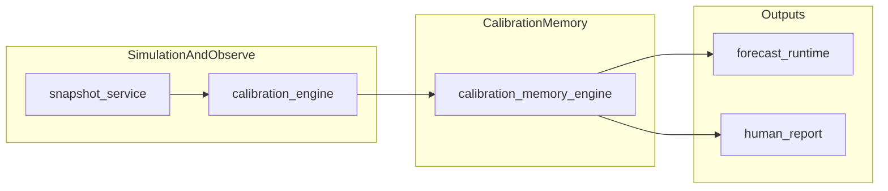
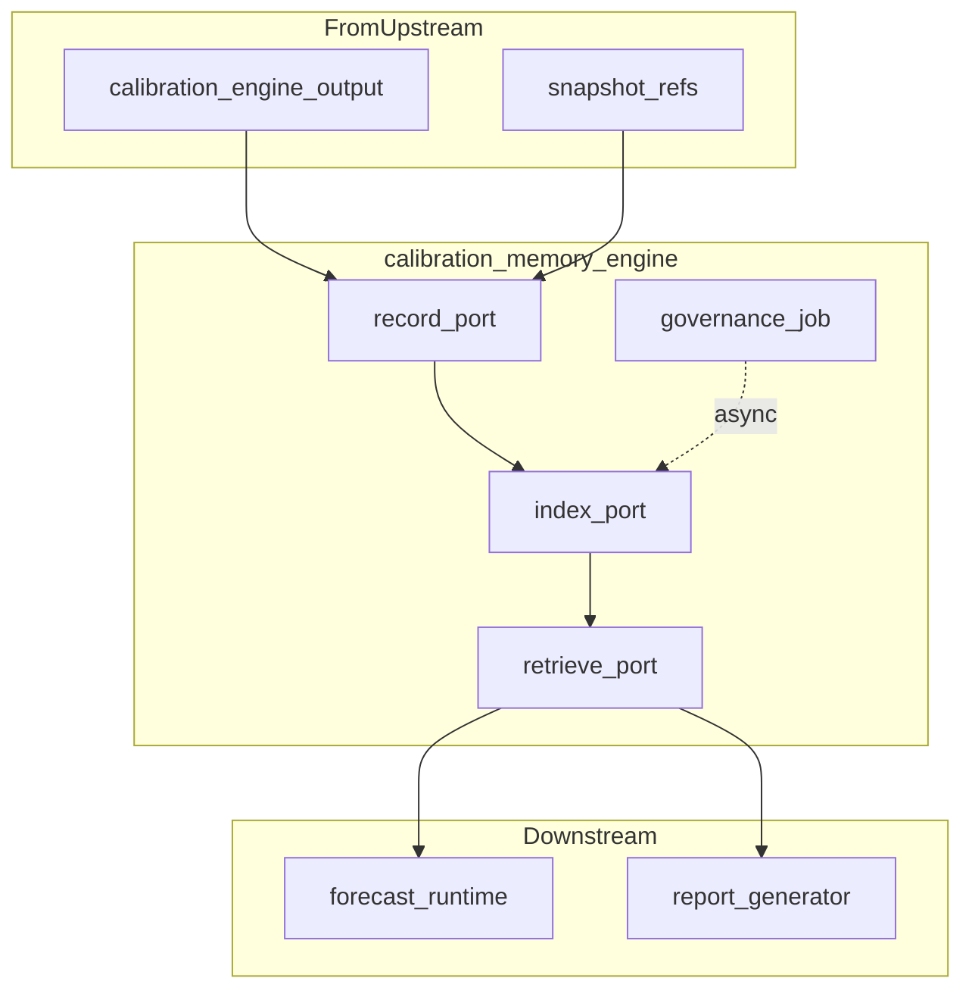

# 调研与设计：校正记忆与经验库

**日期：** 2026-03-28  
**状态：** 成稿 v0.1 · 可迭代（工作草稿见 `rag_design/drafts/调研与设计-校正记忆与经验库.md`）

**依据：** [需求说明-校正记忆与经验库.md](../需求说明-校正记忆与经验库.md) · [基于 EvoPalantir 的现实对齐模拟方案.md](../../../knowledge/基于%20EvoPalantir%20的现实对齐模拟方案.md) §4.8–5.1 · [自进化Agent…](../自进化Agent：经验写回的运行时记忆闭环机制/自进化Agent：经验写回的运行时记忆闭环机制.md)

---

## 1. 问题与边界

**要解决：** 在「快照 → 校正 → 推演」主链路中，持久化 **预测 vs 现实** 的误差与校正动作，支持 **相似情境下的案例召回** 与 **经验总结**，并向 **推演** 与 **人读报告** 两类下游提供输入（见需求说明 §4.1）。

**明确不做（与知识库 §4.10 一致）：** V1 **不** 自动改写 `calibration_engine` 或仿真主逻辑；先做 **记录、检索、总结**。

**本轮文档边界：** 断言与数据流 **仅** 对齐 `knowledge/` 与 `rag_design`；与 `MemOS/`、`EvoSim/` 等 **仅逻辑接轨**，**不** 绑定具体仓库内路径或 API（实现阶段再挂钩）。

---

## 2. 主数据流与模块位置

知识库 §4.12 固定顺序（摘录）：

`… → snapshot_service → Snapshot → calibration_engine → 校正后的状态 → calibration_memory_engine → 误差经验 / 相似案例 → forecast_runtime → …`

---

## 3. 校正记忆引擎：解耦子能力

将 `calibration_memory_engine` 视为 **一组可替换实现背后的契约**，而非单块巨石。

| 子能力 | 输入（概念） | 输出（概念） | 不负责 |
|--------|----------------|----------------|--------|
| **记录 Record** | 快照 id、校正前后指标、采用规则与超参（α、λ 等）、事件/阶段标签 | 可追溯的一条「校正运行」记录 | 执行校正计算（属 `calibration_engine`） |
| **索引 Index** | 结构化键：事件类型、阶段、误差模式等；可选向量键 | 可查询的视图 / 索引行 | 业务 tick 推进 |
| **检索 Retrieve** | 当前情境描述 + 结构化过滤 | Top-K 相似案例 + 元数据 | 直接修改仿真状态 |
| **治理 Govern** | 新记录、使用反馈、去重规则 | 合并、降级、剪枝建议或批处理结果 | 同步阻塞主链路（宜异步） |
| **下游适配** | 检索结果 | `forecast_runtime` 可读工件；报告生成器可读视图 | 推演算法本身 |

**解耦要点：** `forecast_runtime` 与 `report_generator` **只依赖**「检索/查询端口」返回的 **稳定结构**（如 JSON schema 版本化），与底层是 MLflow 还是其他存储 **无关**。

---

## 4. V1 留痕载体：MLflow 与可替换接口

**结论（与知识库 §5.1 一致）：** V1 以 **MLflow Tracking** 作为校正记忆 **实验/指标/参数留痕** 的 **默认实现**，实现层 **可替换**。

**所谓「并列选项 / 可替换载体」指什么（非 V1 并行全做）：** 指 **将来** 可接入 **同一抽象端口** 的其他后端，例如：

- 同类 **实验跟踪**：Weights & Biases、Neptune、TensorBoard 等（能力与 MLflow 重叠部分）  
- **自建**：关系库 + 对象存储存放指标与 artifact  
- **记忆专用栈**（知识库 §5.2 已提及方向）：Mem0、LangMem 等偏 **语义与长期治理**；MemOS 等偏 **统一记忆与 Skill 运行时**（具体能力须查官方文档，本文不列 API）

**预留方式（逻辑层）：** 定义 **记录端口** `CalibrationTraceSink`（名称可改）：`append_run(context, metrics, params, tags, artifact_refs)`、`query_runs(filter) → rows`；**默认适配器** `MlflowTraceSink`，日后增加 `Mem0TraceSink` 等 **不修改** `forecast_runtime` 消费结构，仅扩展写入与索引。

---

## 5. 调研摘录：文献框架 → 本场景映射

综述与对比表见 [自进化Agent…](../自进化Agent：经验写回的运行时记忆闭环机制/自进化Agent：经验写回的运行时记忆闭环机制.md)。下表仅 **映射到校正记忆**（队友可继续补论文级引用）。

| 框架 | 本场景可借鉴点 |
|------|----------------|
| **MEMRL** | 检索 **两阶段**：结构化/语义候选 + **效用或效果**重排；效用可来自「上次校正后误差是否缩小」等 **延迟反馈**（V1 可简化） |
| **ReasoningBank** | 将多次校正提炼为 **短策略条目**（标题+情境+要点），供报告与可选 LLM 总结 |
| **ReMe** | **治理** 异步：去重、合并同类误差模式、剪枝低价值记录 |
| **MACLA** | 将「字段级校正规则模板」视为 **可版本化程序片段**，附 **置信度**；**不** 等价于自动改线上规则 |
| **AgentRR** | **记录 + 摘要 + 受控重放**：与快照 id 关联，支持审计与反事实对照（与 `snapshot_service` 协作） |
| **AgentEvolver** | **训练期** 自进化为主；运行时仅借鉴「经验池引导」思想；**步骤级归因** 可轻量映射到「误差归因到指标/规则」 |

---

## 6. 工程参照（须核实来源）

| 参照 | 可借鉴方向（逻辑） | 说明 |
|------|---------------------|------|
| **MemOS** | 统一记忆层、与 Agent/Skill 编排结合 | 仓库：[MemTensor/MemOS](https://github.com/MemTensor/MemOS)；**具体 API 以官方为准** |
| **OpenViking** | 上下文/资源分层组织 | 仓库：[volcengine/OpenViking](https://github.com/volcengine/OpenViking)；**勿臆造 URI 方案** |
| **Mem0 / LangMem** | 长期语义记忆、总结与反思 | 知识库 §5.2 已指向 MVP 后引入；文档见各自官网/GitHub |

---

## 7. 必选下游（人读侧）形态选项

需求说明未定 UI。设计侧 **备选**（实现时再选）：

- MLflow UI + 导出（CSV/Markdown）  
- Notebook / 静态报告模板  
- 最小内部仪表盘  

**推荐原则：** 先 **保证指标与案例可追溯、可对比**，再追求交互。

---

## 8. 数据形态与合规（选项与风险）

**不在此裁决** 是否存 Reddit 原文或用户标识（与需求说明 §5 一致）。选项留档：

| 选项 | 收益 | 风险 |
|------|------|------|
| 仅聚合指标与脱敏摘要 | 合规面小、存储轻 | 相似案例可解释性弱 |
| 内网存细粒度内容 + 权限与留存策略 | 复盘与检索质量高 | 合规与运维成本高 |

---

## 9. 与 EvoPalantir Skill 哲学的对齐（简述）

架构计划将 **记忆** 视为 **带状态的 I/O Skill**，**反思/纠偏** 为 **Correction Skill** 一类（见 [EvoPalantir 架构与集成实现计划(原版).md](../../../knowledge/EvoPalantir%20架构与集成实现计划(原版).md) 「Agent = LLM + Skills」章节）。校正记忆可对应 **Stateful I/O**：`Commit` 写入校正运行，`Recall` 按情境拉取相似案例；**不** 在本篇展开全文。

---

## 10. 缺口与未决（供队友补充）

- **相似度：** 业务目标已立（需求说明 §4.2）；算法、嵌入、混合检索 **待调研定案**。  
- **效用反馈：** MEMRL 式 Q 更新是否需要、更新频率与离线/在线划分。  
- **报告模板：** 字段与读者（7 人角色）的 **最小集合**。  
- **与 MLflow 的字段映射表：** run params / metrics / tags 与 §4.8 快照字段的 **一一对应**（实现前必填）。  
- **OpenViking / MemOS 深度对照：** 待基于官方文档补 **对照表**。

---

## 引用链接（外部）

- MLflow Tracking：<https://mlflow.org/docs/latest/ml/tracking/>  
- Mem0：<https://docs.mem0.ai/>  
- LangMem（GitHub）：<https://github.com/langchain-ai/langmem>
