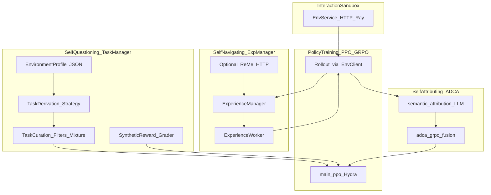

# AgentEvolver：Self-Questioning / Self-Navigating / Self-Attributing 与训练期编排

> **非规范文档。** 本文是外部项目调研，**不定义** EvoPalantir / `rag_design` / `knowledge/` 的正式行为。涉及本仓库的段落仅为 **观察**，不构成设计决策；正式采纳须经评审。

---

## 元数据（必填）

| 字段 | 填写 |
|------|------|
| **日期** | 2026-03-29 |
| **作者/角色** | gpr（调研） |
| **原项目** | AgentEvolver: Towards Efficient Self-Evolving Agent System · [arXiv:2511.10395](https://arxiv.org/abs/2511.10395)（HTML v1 用于节标题与公式叙事） |
| **仓库 URL** | https://github.com/modelscope/AgentEvolver |
| **基线 commit（强制）** | `a5a8db8689d6493b028107dcb4c27415441581dc`（2026-03-29 `git ls-remote … HEAD`） |
| **检索与阅读记录（强制）** | 下列路径均相对仓库根，且针对 **本基线 SHA**（raw / API tree 核对）：① `README.md`（机制总览、Quick Start、与 ReMe/veRL 关系）全文；② `docs/guidelines/env_service.md` 全文；③ `docs/guidelines/task_manager.md` 全文；④ `docs/guidelines/exp_manager.md` 全文；⑤ `docs/guidelines/adv_processor.md` 全文；⑥ `docs/tutorial/quick_start.md` 全文；⑦ `examples/basic.yaml`、`examples/overall.yaml` 全文；⑧ `launcher.py`（`parse_args` 至 `main()` 子进程启动段）；⑨ 论文 HTML **Abstract、§1 Introduction、§2 Problem Formulation、§3 Self-Questioning 起始段**（未通读 §4–§8 正文细节）。 |

**基线 commit 直链：**  
https://github.com/modelscope/AgentEvolver/tree/a5a8db8689d6493b028107dcb4c27415441581dc

---

## 一句话结论

AgentEvolver 把 **代理任务生成（论文 self-questioning ↔ 实现侧 Task Manager）**、**经验引导探索（self-navigating ↔ Experience Manager + 可选 ReMe HTTP 服务）**、**过程级归因优势（self-attributing ↔ ADCA-GRPO / `adv_processor`）** 接在 **统一环境 HTTP 服务（EnvService + Ray）** 与 **Hydra 配置** 之上，形成 **训练期** 自进化闭环；策略优化侧与 **veRL** 等 RL 基础设施对接（论文 §1 末段），而非「纯外挂记忆库」。

---

## 1. 问题域

论文将痛点归纳为：**手工构造 RL 任务贵**、**多轮工具 Agent 的探索与样本利用差**（arXiv HTML §1）。框架目标是在 **交互沙盒 ℰ** 无先验任务分布与奖励的前提下，用 LLM 驱动 **代理任务分布 F_task(ℰ)** 与 **代理奖励 F_reward(ℰ,g)**，使在代理目标上优化的策略迁移到未知 **p_target(g)**（论文 §2 公式 (4)–(7) 叙事）。

与 EvoPalantir 的边界：**全程发生在训练期策略学习与分布式 rollout**，与 [校正记忆引擎宪章](../plans/2026-03-28-调研与设计-校正记忆与经验库.md) 定义的 **CME（校正后案例记录、异步治理、RetrievalPack 契约）** 不同维；仅可在「经验池 / 归因 / 环境服务」等概念上 **对照阅读**，不得把 GRPO、ADCA、ReMe 训练栈 **误植** 为 CME V1 必选实现。关联锚点：[现实对齐模拟方案](../../../knowledge/基于%20EvoPalantir%20的现实对齐模拟方案.md) §4.8–4.12（主链路仍为仿真–校正–报告，而非 AppWorld 训练）。

---

## 2. 对象界定

**是什么**

- **开源编排 + 文档化子系统：** EnvService（HTTP + Ray actor 环境实例）、Task Manager（环境 Profile → 探索 → 任务推导与筛选）、Experience Manager（rollout/训练侧经验调度与异质 PPO 损失）、Advantage Processor（LLM 打 GOOD/BAD → ADCA-GRPO 优势）。
- **配置驱动：** Hydra `defaults` 拉取 `ppo_trainer`、`agentevolver`（见 `examples/*.yaml`）；实验开关集中在 `task_manager`、`exp_manager`、`attribution_driven_credit_assignment` 等键。
- **启动器：** `launcher.py` 可选拉起 ReMe、AppWorld/BFCL/Webshop 等（`--with-*`），备份 `config`/`agentevolver` 后以 `python -m agentevolver.main_ppo --config-path … --config-name …` 启动训练（见下文 §3.4）。

**不是什么**

- **不是** 仅 ReMe：ReMe 为 **可选 HTTP 后端**（`exp_manager.reme.*`），`examples/basic.yaml` 中 `enable_summarizer` / `enable_context_generator` 均为 `False` 时可在无经验池模式下跑 GRPO。
- **不是** EvoPalantir 的 CaseStore：经验存于 ReMe workspace / 向量后端（见 `docs/guidelines/exp_manager.md` ReMe 启动示例），与 `CaseRecord` 契约无关。

**与论文命名的映射（有出处）**

| 论文机制（§1–§3 标题） | 实现与文档主锚点 |
|------------------------|------------------|
| Self-questioning | `docs/guidelines/task_manager.md`；论文 §3 图 3「探索 → 任务合成 → 筛选」 |
| Self-navigating | `docs/guidelines/exp_manager.md`（`ExperienceManager` / `ExperienceWorker`）；论文 §1  bullet |
| Self-attributing | `docs/guidelines/adv_processor.md`（ADCA-GRPO）；论文 §1 bullet 与 §2 代理奖励 (5) |

**与源笔记对齐：** [自进化Agent…](../自进化Agent：经验写回的运行时记忆闭环机制/自进化Agent：经验写回的运行时记忆闭环机制.md) §二.6 的叙事与 README 表格数字一致；**机制细节以本仓库 guidelines + 论文章节为准**。

---

## 3. 机制拆解（事实陈述）

### 3.0 架构总览（数据流）

下列关系综合 **论文 Figure 2 叙事** 与 **guidelines 中的职责描述**；**非** 官方单独一页的架构图复刻。

- **EnvService：** 对外 REST（`/create`、`/step`、`/release` 等），内部 **Ray actors** 托管实例（`docs/guidelines/env_service.md`）。
- **Task Manager：** 消费 EnvService + Profile，产出 **训练任务数据**；可 **standalone** `python -m agentevolver.module.task_manager` 或与训练 **集成**（`task_manager.md`）。
- **训练主进程：** 默认入口 `agentevolver.main_ppo`（`launcher.py` `--target` 默认值）。
- **Experience Manager：** 在 rollout 注入检索经验、异步摘要入池、训练消息剥离模板；并与 **heterogeneous PPO** 损失协作（`exp_manager.md`）。
- **Advantage Processor：** LLM 步骤标签 + `decouple` 等方案融合 ORM/PRM，再 **suffix sum**、**broadcast 到 token**（`adv_processor.md`）。

### 3.1 Self-Questioning（Task Manager）

**职责（文档原句归纳）：** 探索环境并 **画像** 潜在任务、发现 **合成任务**、**策展** 质量与数量、提供 **内置合成奖励** 作回退（`docs/guidelines/task_manager.md` 开篇列表）。

**环境概念模型：** **Environment Profile**（JSON）包含 **Entity / Attribute（attrs）/ Operation（opts）** 与 **task_preference**；可从 `environment_profile_template.json` 复制为 `environment_profile.json`（同文档）。

**流水线三阶段（文档 + 图说明）：**

1. **Environment exploration：** EnvService + Profile。  
2. **Task derivation：** **Strategy**（默认 **RandomWalk**，`strategy: random`，`strategy_args` 含 `max_explore_step`、`env_url: ${env_service.env_url}` 等）。  
3. **Task curation：** **DeduplicationFilter**、**FeasibilityFilter**、**UnifiedMixtureStrategy**；**Judge** 提供训练用奖励信号（同文档「Workflow」小节）。

**集成模式说明：** 若 `train_data_path` / `val_data_path` **未** 在集成模式下设置，则 **训练过程中动态生成** 合成任务，训练结束后丢弃（`task_manager.md`「Dynamic vs Static」注记）。

**与论文：** §3 将 self-questioning 表述为 **F_task** 的实现管道（探索 → 合成 query + 参考解 → **回放验证可行性** 等，论文 Figure 3 说明；本文未逐段核对论文 §3.2 以后与代码的字段级一一映射）。

### 3.2 Self-Navigating（Experience Manager + ReMe）

**核心类（文档）：** `ExperienceManager`（调度、异步摘要、训练/rollout 模式）；`ExperienceWorker`（rollout 注入、训练期剥离模板）（`docs/guidelines/exp_manager.md`）。

**动态分配（文档中的配置语义）：**

- **任务级（训练样本）：** `train_sample_mode`：`allkeep` / `alldiscard` / `hybrid`（配合 `train_sample_keepratio`）。  
- **Rollout 级：** `train_rollout_mode` / `val_rollout_mode`：`woexp` / `mixed` / `all`；`mixed` 时由 **`rollout_ratio`** 控制带经验 rollout 比例（同文档参数节）。

**异步摘要：** `ExperienceManager.submit_summary_task` 通过线程池调用 `em_client.call_summarizer`，并传入 `reme_config.workspace_id`（文档代码块）。

**Rollout 注入：** `ExperienceWorker.manage_rollout_context` 通过 `em_client.call_context_generator` 取 top-K，再按 `experience_template` 拼到当前步 `content` 前（文档代码块）。

**训练剥离：** `manage_training_context` 用 **正则** 按模板剔除经验段，避免模型死记注入前缀（文档代码块）。

**异质损失：** `het_compute_token_on_off_policy_loss` 用 **`exp_mask`** 区分 on-policy token 与经验 token，分别 clip 后聚合（文档摘录；完整形状与调用图 **未** 在本文对 `het_core_algos.py` 做行级核对）。

**ReMe：** `reme.base_url`、`workspace_id`、`enable_summarizer`、`enable_context_generator`、`retrieve_top_k`、`updated_freq` 等（`exp_manager.md`）；Quick Start 给出独立终端启动 `reme` CLI 的示例（`docs/tutorial/quick_start.md` Part B）。

### 3.3 Self-Attributing（Advantage Processor / ADCA-GRPO）

**文档定位：** 解决长程 **credit assignment**，将信号拆为 **过程质量** 与 **结果有效性**，实现 **逐步信用分配**（`docs/guidelines/adv_processor.md` Overview）。

**三阶段管道（同文档）：**

1. **语义评估：** `semantic_attribution.py` 中 **`evaluate_step_flags_parallel`**（异步核心，见 `__all__` 导出）与 **`evaluate_step_flags_parallel_sync`**（同步包装，同文件）：组 batch、构造 prompt、并行 API、`parse_batch_evaluation_result` → **每步 bool（GOOD/BAD）**（`adv_processor.md` 小标题侧重 API 行为描述，与源码双入口并存）。  
2. **信号融合：** `adca_grpo.py` 中 `compute_prm_grpo_advantages` → **`_build_decouple`（推荐 `prm_scheme: decouple`）**：PRM 与 ORM **分组 z-score 再融合**，`alpha` / `beta` 控制权重。  
3. **优势到 token：** `suffix_sum_on_steps` + `broadcast_step_adv_to_tokens`（`step_ids` 映射），写回 `batch` 供策略训练（同文档）。

**配置主开关：** YAML 键 **`attribution_driven_credit_assignment`**（`examples/basic.yaml` 中 `enable: false`，`overall.yaml` 中 `enable: true`）。

**论文与实现名称：** 论文使用 **self-attributing** 与 **代理奖励 F_reward**；实现侧文档品牌名为 **ADCA-GRPO**——§6 记为「命名层级差异」。

### 3.4 运行与配置（Launcher + Quick Start + 示例 YAML）

**依赖与环境（Quick Start）：** 一次性格式化 Conda、`DASHSCOPE_API_KEY`、`HF_ENDPOINT`（`docs/tutorial/quick_start.md`）。

**典型路径：**

- **Basic GRPO：** `conda activate appworld` → `bash env_service/launch_script/appworld.sh`；另开终端 `conda activate agentevolver` → `bash examples/run_basic.sh`（Part A）。  
- **完整 AgentEvolver：** 同上 EnvService + 启动 ReMe（Part B 环境变量与 `reme` 命令）→ `bash examples/run_overall.sh`（Part B）。  
- **多节点：** 手动 `ray start` 集群，EnvService 常驻 **单节点**，脚本中改 `env_url`（Part C）。

**`launcher.py`（已读段）要点：**

- `--conf`：要求 `.yaml`；读取 `trainer.experiment_name`，备份 `./config` 与 `./agentevolver` 到 `launcher_record/<exp>/backup/`，并把 YAML 复制为 `launcher_record/<exp>/yaml_backup.yaml` 后 **替换 `${trainer.experiment_name}` 占位符**。  
- `--target`：默认 `agentevolver.main_ppo`；真正执行 `python -m <target> --config-path <abs_dir> --config-name <yaml>`。  
- `--with-appworld` / `--with-reme` / …：通过环境变量 `APPWORLD_PATH`+`APPWORLD_SCRIPT`、`REME_PATH`+`REME_SCRIPT` 等 **PTY 拉起** 子服务（`pty_launch`）。  
- `--with-logview`：额外起 `web_display.start_web` 并尝试打开浏览器（已读段逻辑）。

**`examples/basic.yaml` 顶层（节选事实）：** `hydra.searchpath` 含 `file://external/config_fallback`、`file://config`；`defaults: ppo_trainer, agentevolver`；`exp_manager` 关闭经验检索与摘要；`attribution_driven_credit_assignment.enable: false`。

**`examples/overall.yaml` 差异事实：** `task_manager.n: 8`；`exp_manager` 打开 **mixed** rollout、`init_exp_before_training: True`、ReMe **summarizer + context_generator**；`attribution_driven_credit_assignment.enable: true`。

---

## 4. 与 EvoPalantir 既定设计的对比（事实对齐）

| 维度 | 外部方案 | 本仓库（出处） |
|------|----------|----------------|
| 目标 | 训练期 **策略梯度**（GRPO + 可选 ADCA），优化 **对话策略** | CME：**不** 训练主模型；消费校正事件（[宪章](../plans/2026-03-28-调研与设计-校正记忆与经验库.md) §1.1） |
| 经验形态 | ReMe 向量 workspace、自然语言经验条、**注入 prompt** | `CaseRecord` + 结构化索引；下游 **`RetrievalPack` 契约**（宪章 §2.1、§1.3） |
| 归因 / 反思 | **逐步 GOOD/BAD** → token 优势 → **更新策略** | **大偏差 Reflexion**、案例级 `reflection_text`；**无** token 级 GRPO（宪章 §1.3 CaseIngest） |
| 环境 | AppWorld / BFCL 等 **HTTP EnvService** | `simulation_runtime` + `snapshot_service`（知识库 §4.12） |
| 治理与时序 | 训练步上 **同步** 优化；经验摘要 **后台线程**（文档） | **Governance 异步、不阻塞 tick**（宪章 §1.2） |
| 可移植结论 | 基准与论文数字 **不** 映射到校正业务 KPI | 仅方法论对照，**不**  import 其 leaderboard 为需求 |

---

## 5. 重要源码坐标（基线 `a5a8db…`）

### 5.1 文档（查阅优先级高）

| 主题 | 路径 | 备注 |
|------|------|------|
| 环境服务 | `docs/guidelines/env_service.md` | REST 路径表、AppWorld `/create` `/step` JSON 示例 |
| 任务管理 | `docs/guidelines/task_manager.md` | Profile、策略、策展、standalone 命令 |
| 经验管理 | `docs/guidelines/exp_manager.md` | ReMe 配置矩阵、heterogeneous loss 摘录 |
| 归因优势 | `docs/guidelines/adv_processor.md` | ADCA 三阶段与 YAML 参数表 |
| 上手 | `docs/tutorial/quick_start.md` | Basic / Overall / 多节点 |
| 接口补充 | `env_service/interface.md` | env_service.md 引用 |

### 5.2 代码与配置（训练链路）

| 主题 | 路径 | 备注 |
|------|------|------|
| 启动器 | `launcher.py` | argparse、`main_ppo` 子进程 |
| 训练入口 | `agentevolver/main_ppo.py` | Hydra 默认 target |
| 环境客户端（训练侧封装） | `agentevolver/client/env_client.py` | guidelines 称已集成 |
| 环境服务入口 | `env_service/env_service.py` | `python -m env_service.env_service` |
| 环境 HTTP 客户端（服务侧同名） | `env_service/env_client.py` | 与上并列存在，调用前确认上下文 |
| Task Manager 包 | `agentevolver/module/task_manager/` | 含 `task_manager.py`、`strategies/random/`、`filters/`、`rewards/` |
| Task Manager CLI | `agentevolver/module/task_manager/__main__.py` | 对应 `python -m agentevolver.module.task_manager` |
| 经验管理 | `agentevolver/module/exp_manager/exp_manager.py` 等 | 与 `het_core_algos.py`、`het_actor.py` 同目录 |
| 归因 | `agentevolver/module/adv_processor/semantic_attribution.py` | 步骤标签 |
| ADCA-GRPO | `agentevolver/module/adv_processor/adca_grpo.py` | 融合与优势 |
| 管道封装 | `agentevolver/module/adv_processor/adca_grpo_pipeline.py` | 与 pipeline 编排相关（**未读文件内联**） |
| 示例配置 | `examples/basic.yaml`、`examples/overall.yaml` | 开关对照 |
| 启动脚本 | `examples/run_basic.sh`、`examples/run_overall.sh` | Quick Start 引用 |

---

## 6. 文档 vs 源码/论文差异（已核对范围内）

1. **默认端口表述：** `docs/guidelines/env_service.md` 的 CLI 参数表中 `--port` **默认** 写为 `8000`；而同文档中 `appworld.sh` / `bfcl.sh` 示例为 **`8080`**。部署以 **实际脚本 `exec python -m env_service.env_service … --port`** 为准。  
2. **论文章节 vs 配置键名：** 论文使用 **self-attributing** 与连续公式符号；实现中用户可见开关为 **`attribution_driven_credit_assignment`** 与 **`adca_grpo`** 子键（`adv_processor.md`）。属于 **术语层级差异**，非功能缺失。  
3. **`rollout_ratio` vs 文档代码片段字段名：** `exp_manager.md` 在 `allocate_add_exp` 摘录中使用 `self.rollout_expratio`，而 YAML 与参数说明表使用 **`rollout_ratio`**。**字段如何从 YAML 绑定到 Python 属性** 未在本文对 `exp_manager.py` 做行级核对，遗留实现细节以源码为准。  
4. **未核对范围（显式）：** `config/` 与 `external/config_fallback` 中 **Hydra 拼接后的全量默认**；`adca_grpo_pipeline.py` 与 veRL 内部 **worker** 的调用图；论文 §4–§8 与代码的 **一一对照**。

---

## 7. 观察：对校正记忆（CME）的启示

> **非规范性观察。** 不构成设计决策；采纳须经 spec/评审。

### 7.1 可借鉴

- **Task Manager 的 Profile（Entity/Attribute/Operation）** 可类比「校正情境」的 **结构化模式**，用于讨论 Case 模式库（**非** 要求 CME 实现随机游走探索）。  
- **经验注入 + 训练剥离（`experience_template` + 正则清洗）** 与「检索块必须可版本化、可审计」的治理思路可对谈；EvoPalantir 已用 **契约与免责声明** 约束下游（宪章 §2.1）。  
- **ADCA 的「过程 vs 结果」双通道** 与 CaseIngest **大偏差反思** 同属「别把稀疏终点信号当唯一监督」，但 **载体不同**（token 优势 vs 案例摘要）。

### 7.2 应保持的差异化（不盲从）

- **CME 不引入 GRPO / token 级 exp_mask / ReMe 服务依赖** 作为 V1 默认；训练框架与校正引擎 **解耦**。  
- **异步治理**（宪章 §1.2）≠ 训练循环内 **同步多进程 rollout**；不得混谈 SLA。

### 7.3 明确不做

- 不在 EvoPalantir 仓库复刻 AppWorld、Ray 集群、ADCA API 流水线。  
- 不把论文 benchmark 表格 **误读** 为校正系统验收标准。

---

## 8. 参考来源

- 论文：[arXiv:2511.10395](https://arxiv.org/abs/2511.10395)（HTML v1：https://arxiv.org/html/2511.10395v1 ）  
- 仓库（基线）：https://github.com/modelscope/AgentEvolver/tree/a5a8db8689d6493b028107dcb4c27415441581dc  
- 官方文档（基线）：`docs/guidelines/*.md`、`docs/tutorial/quick_start.md`、`docs/index.md`（根 README 指向）  
- 源笔记：[自进化Agent…](../自进化Agent：经验写回的运行时记忆闭环机制/自进化Agent：经验写回的运行时记忆闭环机制.md) §二.6  
- 二手综述登记：[2026-03-29-zhihu-csdn-memory-loop-survey-sources.md](./2026-03-29-zhihu-csdn-memory-loop-survey-sources.md)
