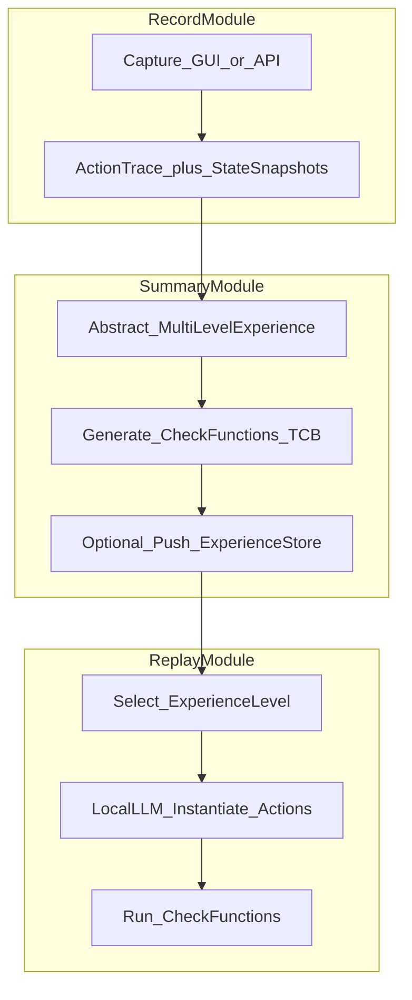

# AgentRR：多级经验 + 检查函数的 Agent 录制–摘要–回放（论文深度调研；无官方仓库）

> **非规范文档。** 本文是外部项目调研，**不定义** EvoPalantir / `rag_design` / `knowledge/` 的正式行为。涉及本仓库的段落仅为 **观察**，不构成设计决策；正式采纳须经评审。

---

## 元数据（必填）

| 字段 | 填写 |
|------|------|
| **日期** | 2026-03-29 |
| **作者/角色** | gpr（调研） |
| **原项目** | *Get Experience from Practice: LLM Agents with Record & Replay*（AgentRR）· 上海交通大学 IPADS 等 · [arXiv:2505.17716](https://arxiv.org/abs/2505.17716) |
| **仓库 URL** | 无（截至 2026-03-29，arXiv 页与论文 HTML 未给出作者官方实现仓库；Case Study 引用 Chrome Recorder、Playwright 等 **第三方工具**，非 AgentRR 本体代码） |
| **基线 commit（强制）** | **无仓库；依据为** arXiv **2505.17716v1**（提交 UTC：**2025-05-23**）；正文引用以 **HTML 实验版本** https://arxiv.org/html/2505.17716v1 的章节编号为准（与 PDF 结构一致时可交叉核对） |
| **检索与阅读记录（强制）** | ① arXiv HTML v1 **Abstract 全文**；② **§1 Introduction** 全文（四挑战、AgentRR 定位、多级经验与三阶段总览、应用模式表 1、Experience Store 设想）；③ **§2 Related Work**（2.1–2.3 主干，含与传统 R&R / Workflow Use 对比段）；④ **§3**（3.1–3.4，含状态转移图、多级经验、检查函数四类验证）；⑤ **§4** Record / Summary / Replay 三模块；⑥ **§5 Case Study**（在线表单：Chrome Recorder + Playwright Codegen、高低层经验切换、CheckFunction 字段顺序例）；⑦ **§6 Discussion**、**§7 Conclusion** 要点；**未** 对 PDF 做 OCR/附录级逐图核对。 |

**基线说明：** 无 Git 时以 **论文版本 + HTML 节锚** 为可复现锚点；任何实现层细节须待官方代码或独立复现时再收紧。

---

## 一句话结论

AgentRR 用 **「有界智能」** 设计哲学：在 **Record → Summary → Replay** 三阶段中把轨迹压成 **多级经验**（低层偏可执行、高层偏可泛化），并为每层配备 **检查函数** 作为 **TCB（Trusted Computing Base）**，在回放时约束执行流、前置条件、参数与安全不变式，从而在 **不追求比特级复现** 的前提下，折中 **可靠性、隐私、成本、性能** 与 **泛化**。

---

## 1. 问题域

论文将 LLM Agent 落地障碍归纳为四类（§1）：**可靠性**（幻觉与非确定性）、**隐私**（云上多模态数据上传）、**运营成本**（多轮与 VLM 调用昂贵）、**执行性能**（推理链路过长）。对齐、工作流约束、端侧小模型、蒸馏/剪枝等 **或** 缺形式化安全保证 **或** 场景固化难以随任务迁移。

与 EvoPalantir 关联：**受控回放 + 前置校验** 可与 [校正记忆引擎宪章](../plans/2026-03-28-调研与设计-校正记忆与经验库.md) 中可选 **WorkflowCheckpointModule**（编排状态 checkpoint/replay，**非** 主记忆库）、**CaseRecord 可追溯**、以及下游消费 **RetrievalPack** 时的 **契约与免责声明**（§1.3、§2.1）对照；主业务锚点仍为 [现实对齐模拟方案](../../../knowledge/基于%20EvoPalantir%20的现实对齐模拟方案.md) §4.8–4.12（**仅关联**，AgentRR 不定义校正语义）。

---

## 2. 对象界定

**是什么**

- **范式名：** AgentRR = **Agent Record & Replay**（摘要编号 ①②③）。
- **核心工件：** **Experience**（摘要阶段从轨迹抽象出的、封装工作流与约束的结构化知识）；**Check function**（与各级经验绑定，回放时验证）；**Experience Store**（论文设想的集中式上传/检索/评分/审计元数据仓库，§3.3）。
- **形式化骨架：** **状态转移图**——节点为环境状态 \(S\)，边为 **元操作** 级动作（如 `click`、`type`、`call_api`）；**经验** 被表述为相似任务上轨迹的汇总，用以 **缩小模型动作搜索空间**（§3.4）。
- **三模块（§4，对应 Figure 3）：** **Record**（采状态 + 导致转移的操作）、**Summary**（多粒度模板化、合并节点形成高层经验、**生成检查函数**）、**Replay**（按当前任务/环境选经验层级，本地模型将经验 **实例化** 为具体动作，并 **执行检查**）。

**不是什么**

- **不是** 传统系统 R&R 的 **比特级忠实重放**：论文明确 AgentRR 目标是 **一类安全执行的广义经验**，回放阶段允许在 **指定节点内** 保留模型「创造性」输出，非确定性主要来自此（§2.3 与 AgentRR 对比段）。
- **不是** MCP/A2A 的协议规范：二者仅在 §1 作为 **行业背景**（工具链与多 Agent 协调）出现。
- **不是** EvoPalantir 的 `CaseStore`：论文经验面向 **交互任务自动化**，与校正案例 **本体不同**。

**与源笔记对齐：** [自进化Agent…](../自进化Agent：经验写回的运行时记忆闭环机制/自进化Agent：经验写回的运行时记忆闭环机制.md) §二.5 的 Record–Summary–Replay、层次经验、检查函数与 **论文 §1–§4** 一致；源笔记未包含 **状态图形式化、TCB、Experience Store、Table 1 录制/回放主体组合** 等细节，以后者为准。

---

## 3. 机制拆解（事实陈述）

### 3.0 架构总览（论文 Figure 3 + §4）

### 3.1 设计哲学：有界智能 vs 纯 LLM / 纯脚本

- **纯 LLM：** 泛化强，但 **概率性错误** 与 **难恢复错误状态**（§1）。  
- **传统 R&R（如 Playwright 录制）：** 高确定、高效率，**泛化弱**。  
- **AgentRR：** **结合** 模型泛化与地面 **已验证经验**；强调 **经验过粗 → 实例化失败 / 过细 → 难复用** 的张力，用 **多级** 动态选型缓解（§1 末段、§3.2.1）。

### 3.2 多级经验（§3.2.1、Figure 2）

| 层级 | 论文描述要点 | 回放侧要求 |
|------|----------------|------------|
| **低层** | 精确行为（具体 UI 操作或 API 调用序列）；与 **原环境/UI 布局** 强耦合 | 环境高度一致时 **更快、更可靠** |
| **高层** | 任务规划过程，**不绑定** 特定平台或布局 | **必须** 依赖本地模型结合当前上下文生成具体动作；降低对回放端模型能力的绝对要求 |

**动态选择规则（论文陈述）：** 执行平台与应用与录制时 **一致** 时倾向 **低层**；**平台或应用变化** 时改用 **高层** 以换取泛化（§3.2.1）。

### 3.3 检查函数 Check Functions（§3.2.2）

论文将检查函数定位为经验泛化边界的 **TCB**；可由 **用户显式代码** 或 **用户描述 + ML 摘要** 生成，并经 **人工审计** 建立信任。

**四类验证（论文列举）：**

1. **Execution flow integrity：** 禁止进入未定义状态（例：未经确认的支付）；可结合 **UI/OCR** 或 **系统层网络拦截**。  
2. **State preconditions：** 字段间依赖（如表单）—后续动作前前置字段须满足条件。  
3. **Data / parameter constraints：** 执行产生的参数须与 **Experience 中约束** 及 **用户任务** 一致（输出不预先写死在经验中）。  
4. **Safety invariants：** Summary 或手工指定的 High-level 安全不变式；**循环次数** 等虽不破坏流程图完整性但可能影响正确性，需 **专门验证**（§3.2.2）。

### 3.4 状态、动作、轨迹（§3.4）

- **状态：** 任务相关快照（应用/窗口、UI 元素、文件系统、抽象如「已登录」）；可多粒度，**多个低层状态可聚合为高层状态**。  
- **动作：** 元操作集合（点击、输入、滑动比例、API 调用等），用于 **压缩** 状态转移图复杂度。  
- **轨迹：** \(S_0 \xrightarrow{A_1} S_1 \cdots \xrightarrow{A_n} S_n\)；AgentRR 目标为使轨迹在 **所选经验** 下 **合法**；**经验** 被定义为相似任务轨迹的 **摘要集合**，缩小搜索空间；**检查函数** 约束越界泛化（§3.4）。

### 3.5 Experience Store（§3.3）

论文描述为 **中心库**：上传/下载、按任务检索、评分、**审计标记**、元数据（任务描述、作者、版本、使用率等）；实现形态设想为 **JSON 或图数据库**（§3.3）。属 **构想组件**，非已交付产品说明。

### 3.6 Record / Summary / Replay 模块要点（§4）

**Record（§4.1）：** 每步记录 **环境状态** + **导致转移的操作**；需在 **信息量 vs 回放成功率** 间折中（关键交互细录、非关键粗录）；输出为状态图上的 **路径**。

**Summary（§4.2）：** 多轨迹合并为 **可复用经验图**；抽取 **共性**，差异留到 Replay；可多粒度摘要；在状态图视角下是对相似任务轨迹的 **模板化**；**同步生成检查函数**；检查函数形态可为 **代码** 或 **自然语言 + 校验模型**；TCB 应 **显著小于** Agent 模型（§4.2）。

**Replay（§4.3）：** 依赖 **本地模型** 将摘要经验 **落地为动作** 并执行环境交互；**必须** 能运行检查函数并 **阻止** 不安全操作；**经验选择**——同任务多层级、多用户经验时，倾向选 **仍能成功之最低层** 经验，并在频繁任务上 **持续细化** 低层经验；可 **排序/融合** 外来高质量经验（§4.3）。

### 3.7 应用模式：谁录制、谁回放（§1，Table 1）

论文给出 **人–LLM、LLM–人、同模型、模型间、大–小、小–大、不可信–可信、可信–不可信** 等组合及用例（任务自动化、知识迁移、边缘回放、TEE 可信执行、安全探索等）（Table 1）。此为 **设计空间说明**，非实现矩阵。

### 3.8 Case Study：在线表单（§5）

**录制：** Chrome Recorder、Playwright Codegen；附加 URL、任务描述、截图；示例 **两条轨迹**（顺序填表 vs 乱序填表）。  
**摘要：** 先 **重放验证** 可复现性；动态 HTML 导致定位失败时收集 **诊断信息**；有效轨迹与诊断交由 **LLM 摘要**。**高层经验** 多为 LLM 生成的状态/下一步/检查条件描述；**低层** 多为 **API 或可执行脚本**，并对轨迹中 **变量、描述、约束（含检查函数）** 参数化。  
**回放：** 弱模型优先 **低层** 参数化 API；不足则 **退回高层**（需更强模型）。**CheckFunction** 示例：某调用技术上可行，但因 **任一有效轨迹均未出现「gate 之后填 date」** 而被拒，以维护 **字段顺序约束**（§5）。

---

## 4. 与 EvoPalantir 既定设计的对比（事实对齐）

| 维度 | 外部方案（AgentRR） | 本仓库（出处） |
|------|---------------------|----------------|
| 本体 | **交互任务经验 + 检查函数 TCB** | **校正案例** `CaseRecord`、**规则摘录** RuleBook、**留痕** TraceSink（[宪章](../plans/2026-03-28-调研与设计-校正记忆与经验库.md) §2.1、§1.3） |
| 回放对象 | **相似任务上重复执行**（表单、订票等重复性流程） | 可选 **工作流 checkpoint**（编排状态），**明确不** 替代 CaseStore（宪章 §1.3 WorkflowCheckpointModule） |
| 信任机制 | **检查函数**（流/状态/参数/不变式） | **Reflexion 门禁**、**RetrievalPack 免责声明**、结构化契约（宪章 §1.3、§2.1） |
| 证据链 | 录制轨迹、摘要版本、（设想）Store 审计 | **MLflow run** + Case 引用 run（宪章 §1.2） |
| 泛化目标 | **刻意** 在经验层泛化以降低 LLM 调用 | CME **不** 自动改写 `calibration_engine`；检索辅助 **诊断与报告**（宪章 §1.1） |
| 隐私叙事 | 重放本地化、录制阶段可信环境（§1 效益列表） | 现实对齐链路的隐私边界以 **知识库/部署规范** 为准，**非** AgentRR 推导 |

---

## 5. 重要源码坐标与论文锚点（无仓库）

### 5.1 实现代码

| 主题 | 路径 | 备注 |
|------|------|------|
| AgentRR 官方实现 | **N/A** | 截至锚点版本 **未** 公开 |

### 5.2 论文内导航（便于 PDF/HTML 对照）

| 主题 | 锚点（HTML v1） |
|------|-----------------|
| 问题与四挑战 | §1 Introduction |
| 与传统 R&R / Workflow Use 差异 | §2.3；Table 2 |
| 多级经验 + 检查函数定义 | §3.2 |
| Experience Store | §3.3 |
| 状态转移形式化 | §3.4 |
| Record / Summary / Replay 模块 | §4 |
| 表单 Case Study | §5 |
| 局限与未来工作 | §6 Discussion |
| 总结 | §7 Conclusion |

### 5.3 Case Study 引用的 **外部** 工具（非 AgentRR 源码）

- Chrome DevTools Recorder（论文参考文献指向 Chrome 文档）  
- Playwright Codegen（`playwright.dev/docs/codegen` 等，见论文 References）

---

## 6. 文档 vs 源码/实现差异（若有）

1. **无源码可对照**：本节以 **论文自洽性 + HTML 转写质量** 为主；若未来发布实现，应新增 **基线 SHA** 并重写 §5–§6。  
2. **HTML 转写笔误（可核查）：** Case Study 段出现 **「Vaild traces」「dignostic」** 等拼写错误（§5），不影响机制理解但引用英文原句时建议 **以 PDF 为准** 交叉核对。  
3. **Related Work 排版：** §2.3 叙述中出现 **「Experienc」** 缺字（对比 Workflow Use 段），与后文 **Experience** 正式拼写并存——引用时以 **摘要/§3 定义** 为准。  
4. **设想 vs 已验证：** Experience Store、多用户经验市场、TEE 回放等为 **设计构想**（§1、§3.3、§6 User burden）；**不得** 写成已普遍部署能力。  
5. **未用 PDF 工具复现：** 图表编号（Figure 1–4）依赖 HTML；若 PDF 分页不同，**节号** 仍应以 arXiv **官方 PDF 目录** 为最终争议解决。

---

## 7. 观察：对校正记忆（CME）的启示

> **非规范性观察。** 不构成设计决策；采纳须经 spec/评审。

### 7.1 可借鉴

- **多级抽象：** 与「原始 trace → 规范化 Case → 短规则 RuleBook」的 **渐进抽象** 可对谈；**低层可核对、高层可泛化** 的张力与 CME **结构化索引 + 可选向量** 的分工有类比价值。  
- **检查函数四类：** 可映射讨论 **Retrieve 结果校验**、**报告生成前约束**、**循环/批量校正边界**（与 §3.3 Safety invariants 类比），但 **落地形式** 须符合宪章 **异步治理、不阻塞 tick**。  
- **Experience Store 的审计/评分叙事：** 与 Governance **效用、去重、规则蒸馏** 的 **产品故事** 可对照，**非** 同一实现。

### 7.2 应保持的差异化（不盲从）

- CME **不** 承担「替代用户逐步操作回放」；**校正数值逻辑** 不可被 **经验脚本** 覆盖（宪章 §1.1）。  
- **TCB 检查函数** 与 **Reflexion/LLM 反思** 成本模型不同；不得默认引入 **逐步 OCR/API 拦截** 为 V1 必选。

### 7.3 明确不做

- 不在 `knowledge/` 或实现 spec 中 **硬编码** AgentRR 的表单案例或检查函数模板。  
- 不因论文 **Experience Store** 构想而扩张 CME 为「面向公众的 Skill 市场」。

---

## 8. 参考来源

- 论文：[arXiv:2505.17716](https://arxiv.org/abs/2505.17716)（v1，2025-05-23）；PDF：https://arxiv.org/pdf/2505.17716；HTML（本调研主阅读面）：https://arxiv.org/html/2505.17716v1  
- 源笔记：[自进化Agent…](../自进化Agent：经验写回的运行时记忆闭环机制/自进化Agent：经验写回的运行时记忆闭环机制.md) §二.5  
- 二手综述登记：[2026-03-29-zhihu-csdn-memory-loop-survey-sources.md](./2026-03-29-zhihu-csdn-memory-loop-survey-sources.md)
