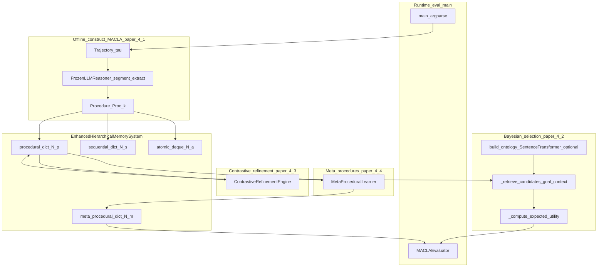

# MACLA：分层程序性记忆 + 贝叶斯期望效用 + 对比精炼（论文与单文件实现）

> **非规范文档。** 本文是外部项目调研，**不定义** EvoPalantir / `rag_design` / `knowledge/` 的正式行为。涉及本仓库的段落仅为 **观察**，不构成设计决策；正式采纳须经评审。

---

## 元数据（必填）

| 字段 | 填写 |
|------|------|
| **日期** | 2026-03-28 |
| **作者/角色** | gpr（调研） |
| **原项目** | *Learning Hierarchical Procedural Memory for LLM Agents through Bayesian Selection and Contrastive Refinement*（MACLA）· [arXiv:2512.18950](https://arxiv.org/abs/2512.18950)。论文 §1 将 MACLA 展开为 **Memory-Augmented Contrastive Learning Agent**；仓库 README 标题写 **Memory-Augmented Continual Learning Agent** 并声明 AAMAS 2026 oral——**缩写相同、英文全称不一致**，以下以 **论文题名与 arXiv HTML v1 正文** 为机制叙事主锚点。 |
| **仓库 URL** | https://github.com/S-Forouzandeh/MACLA-LLM-Agents-AAMAS-Conference |
| **基线 commit（强制）** | `c1f9b4ace8667fe1b7ff06d1b717059840a77541`（2026-03-28 `git ls-remote … HEAD` 核对；`git -c http.proxy= -c https.proxy= ls-remote …` 规避本地代理失败） |
| **检索与阅读记录（强制）** | 下列均针对 **本基线 SHA**，且与 **GitHub `git/trees/…?recursive=1` API** 交叉核对：① 仓库根 `README.md` 全文（Overview、Installation、Quick Start、Architecture、Memory Hierarchy、Learning Pipeline、Experimental Results、Project Structure、Testing）；② `MACLA.py` 全文结构检索（模块注释分区、`argparse`、`main()`、`_prune_procedural_memory` / `_prune_meta_procedural_memory` / `record_execution_outcome`、下列 **类/函数符号**：`AtomicMemoryEntry`、`Procedure`、`MetaProcedure`、`ContrastiveContext`、`ProceduralMemoryEntry`、`EnhancedHierarchicalMemorySystem`、`BayesianProcedureSelector`、`ContrastiveRefinementEngine`、`MetaProceduralLearner`、`FrozenLLMReasoner`、`EnhancedMACLAAgent`、`LLMMACLAAgent`、各 `*Loader`、`MACLAEvaluator`、`PerformanceMetrics`、`build_agent_and_learn` 等）；③ 论文 arXiv **HTML v1**（https://arxiv.org/html/2512.18950v1）：**Abstract**、**§1 Introduction**、**§4 Proposed Method**（§4.1–§4.7 标题与公式 (1)–(8)、Algorithm 1 叙事）、**§6 Conclusion**、**Appendix A** 消融与容量表叙事；④ **§3 The Preamble**（HTML 目录）——内容为 **ACM 类会议论文固定前言模板**，**非 MACLA 方法**，本文 **不** 将其当作技术来源引用。 |

**基线 commit 直链：**  
https://github.com/S-Forouzandeh/MACLA-LLM-Agents-AAMAS-Conference/tree/c1f9b4ace8667fe1b7ff06d1b717059840a77541

**基线仓库文件清单（API 递归树，`truncated: false`）：** 仅 **`MACLA.py`**、**`README.md`** 两个 blob——**不存在** README 所画的 `requirements.txt`、`data/`、`tests/`、`docs/`、`setup.py` 等路径（`https://raw.githubusercontent.com/.../requirements.txt` 对该 SHA 为 **404**）。

---

## 一句话结论

MACLA 在 **冻结 LLM** 前提下，把适应放到 **外部分层程序性记忆**：用 LLM 做轨迹 **分段与程序抽象**（论文 §4.1），用 **Beta 后验** 与 **期望效用 EU** 做 **不确定性-aware 检索排序**（§4.2，式 (3)–(5)），用 **对比式精炼** 更新 Ψ/π/Φ（§4.3，式 (6)），用 **元程序** 与 **Θ ∈ {continue, skip, repeat, abort}** 做层级组合（§4.4），并用 **词嵌入聚类本体**（§4.5，式 (7)）与 **ANN 检索 + 多因素剪枝效用**（§4.6，式 (8)，λ_r/λ_f/λ_t = 0.5/0.3/0.2）控规模。论文摘要报告四基准平均 **78.1%**、ALFWorld unseen **90.3%**、**+3.1%** 泛化间隙、**56 s** 建库相对参数训练基线 **2800×** 加速叙述、**2851→187** 条轨迹压缩为程序等——**未在本环境独立复现**。官方实现 **在本 SHA** 为 **单文件** `MACLA.py`，与论文叙事 **多处为工程近似**（见 §6）。

---

## 1. 问题域

持续交互 Agent 需要在 **少改参数、控 LLM 调用预算** 的前提下积累 **可解释、可复用** 的技能。论文对比「把轨迹训进参数」的路线，主张 **记忆侧学习**：程序与元程序外存、检索与贝叶斯打分向量/符号化完成，必要时才回退零样本 LLM（arXiv HTML §4.2 末段、§4.7）。

与 EvoPalantir 关联：程序 **预条件/后条件/动作草图** 可与 [校正记忆引擎宪章](../plans/2026-03-28-调研与设计-校正记忆与经验库.md) 中的 **RuleBook、治理流水线** 及 [现实对齐模拟方案](../../../knowledge/基于%20EvoPalantir%20的现实对齐模拟方案.md) 里「可复用案例摘要」**对照阅读**；**本体仍是校正案例与契约，不是 ALFWorld 技能库**。

---

## 2. 对象界定

**是什么**

- **论文对象：** 外部分层程序性记忆 + 贝叶斯期望效用选择 + 对比精炼 + 元程序组合 + 本体 grounding + 有界内存管理（§4 各小节）。
- **代码对象（`MACLA.py`）：** 单文件 **域无关** 原型：`EnhancedHierarchicalMemorySystem` 四层 deque/dict；`FrozenLLMReasoner` 通过 **Ollama** 调 LLM；`BayesianProcedureSelector` 建 **词表/嵌入本体**、检索候选、**启发式 EU**；`ContrastiveRefinementEngine` 在成功/失败上下文上做 **词袋差分** 式精炼；`MetaProceduralLearner` 从成功轨迹上的 **程序 ID 序列** 抽取 `MetaProcedure`；多数据集 **Loader** + `MACLAEvaluator` / `main()` CLI。

**不是什么**

- **不是** 纯向量 RAG：核心是 **结构化程序** 与 **Beta 计数**，不是仅文档块检索。
- **不是** EvoPalantir CME：`CaseRecord` / `RetrievalPack` / 异步治理 **未** 在该仓库出现。

**命名与二手材料**

- **论文 vs README：** 「Contrastive」vs「Continual」全称冲突见元数据表；引用机制时请 **打开对应原文** 避免混用。
- **与源笔记对齐：** [自进化Agent…](../自进化Agent：经验写回的运行时记忆闭环机制/自进化Agent：经验写回的运行时记忆闭环机制.md) §二.4 的 Beta/对比/playbook 叙事与 **README 架构图** 一致；**定量表**（README「Experimental Results」）与 **论文 Appendix A** 高度同构——本文以 **论文附录** 为一级出处，README 为 **转述**。

---

## 3. 机制拆解（事实陈述）

### 3.0 架构总览（论文机制 ↔ `MACLA.py`）

下列 **mermaid** 概括 **§4.7 / Algorithm 1** 叙事与代码主类职责的对应关系；**非** 论文原图逐像素复刻。

- **论文侧：** 候选集 **ANN**、EU 排名、阈值 **θ_conf** 回退 LLM、执行后更新 **(α, β)** 与成败上下文、对比触发、元程序蒸馏、剪枝 **U(Proc)**（§4.6–§4.7）。
- **代码侧：** 检索主要为 **目标索引 / 上下文索引 / 执行次数** 启发式（`BayesianProcedureSelector._retrieve_candidates`），**不是** 论文 §4.6 所述 **ANN 子线性检索** 的完整复刻。程序记忆超员时 **`_prune_procedural_memory`** 用 **0.5 / 0.3 / 0.2** 三系数（与论文 λ_r/λ_f/λ_t 数值一致）对 **success_rate、execution_count、距 last_refined 的时长** 组合打分并剔除 **最低** 项——**频率与衰减项与式 (8) 的 n_i/N_total、按 episode 的指数衰减不同**（见 §3.7）。

### 3.1 分层记忆与容量

- **论文：** 程序与元程序均带语义嵌入与 ANN；Episode buffer **N_b = 1000**、每程序失败索引上限 **K_fail = 15**（§4.6）。
- **README：** 示例容量 **N_a=2000, N_s=100, N_p=200, N_m=50**（Memory Hierarchy 小节）。
- **代码：** `EnhancedHierarchicalMemorySystem.__init__(N_a=1000, N_s=100, N_p=200, N_m=50)` 为 **另一组默认**；`LLMMACLAAgent` 构造可覆盖（以 `MACLA.py` 内实际默认为准）。**三组数字并存**——写配置时需 **以运行中的构造函数实参为准**，不可默认 README 与代码一致。

### 3.2 程序表示（⟨G, Ψ, π, Φ⟩ ↔ `Procedure`）

- **论文 §4.1：** `Proc_k = ⟨G_k, Ψ_k, π_k, Φ_k⟩`，嵌入 `φ([G;Ψ;Φ])`，与库内程序余弦相似度超阈则 **合并**（重复抑制）。
- **代码：** `Procedure` 使用字段 `goal`、`preconditions`、`steps`、`postconditions`、`concepts` 及 **Beta** `alpha`/`beta`、`execution_count` 等；`ProceduralMemoryEntry` 挂载 `success_contexts` / `failure_contexts`（`ContrastiveContext`）与 `discriminative_patterns`。**字段级** 与论文符号 **对应但不等价**（例如 `steps` 与抽象动作序列 π 的粒度由 LLM 解析决定）。

### 3.3 贝叶斯可靠度与期望效用（§4.2 ↔ `BayesianProcedureSelector`）

- **论文：** 成功率为 Beta 后验；EU 对 **Rel · ρ · R_max − Risk · (1−ρ) · C_fail + λ_info · I(ρ)** 在后验上积分，并含 **熵项** H[Beta(α,β)]（式 (3)–(4)）；选取 argmax EU，低于 **θ_conf** 则零样本推理（式 (5) 叙事）。
- **代码：** `Procedure.success_rate` / `success_variance` 由 `alpha`/`beta` 闭式给出；`_compute_expected_utility` 将 **relevance**（目标/上下文匹配启发式）、**ρ_mean**、**failure risk** 与 **info_gain**（与 Beta 方差相关项成比例）做 **标量线性组合**（实现中系数为 `1.0`、`0.5`、`0.1` 量级），**不是** 论文式 (3)–(4) 积分的逐字实现。`select_procedure` 以 **`theta_conf`** 截断 EU，与论文 **置信回退** 精神一致。

### 3.4 对比精炼（§4.3 式 (6) ↔ `ContrastiveRefinementEngine`）

- **论文：** `ContrastiveExtract(S_i, F_i)` 产出 ΔΨ⁺/ΔΨ⁻、Δπ、ΔΦ，并按式 (6) **并集/合并** 更新；可由 **LLM** 提出判别特征。
- **代码：** `should_refine` 要求成功/失败上下文数分别 ≥ `n_min_s` / `n_min_f`（默认 3）；`refine_procedure` 对 **初始观察** 做 **词袋差分**，取 **至多 3 个** 成功独有词写入 `discriminative_patterns` 并 **extend** 到 `procedure.preconditions`——**无** LLM 调用、**无** 式 (6) 中对 π、Φ 的显式 Merge 分支。**属于大幅简化的对比信号**。

### 3.5 元程序（§4.4 ↔ `MetaProceduralLearner`）

- **论文：** 元程序 `MP_j` 含元目标、元预条件、子程序集合与 **Θ_j(continue/skip/repeat/abort)**，并有独立 Beta 与细化规则。
- **代码：** `extract_meta_procedure` 在 **成功轨迹** 且 **程序序列长度 ≥ 3** 时生成 `MetaProcedure`，`composition_policy` 为 **`{"type":"sequential","ordering": procedure_sequence, "branching_rules": {}}`**；**未在已读段** 看到 **Θ** 的显式状态机或与观察联动的分支策略实现。**层级串联** 有，**论文级控制策略** 弱或未暴露。

### 3.6 本体与检索（§4.5–§4.6 ↔ 代码）

- **论文：** 高频词 + SentenceTransformer，**sim > θ_sim** 聚类为式 (7)；检索为 **ANN**（§4.6）。
- **代码：** `build_ontology` 从轨迹 `task` 与 `actions` 抽 **长度>3** 的英文词，若 `sentence_transformers` 可用则 **cos_sim > 0.6** 聚类并编码类别；否则按 **首字母** 回退。`_extract_context` 先关键词再语义（阈值默认 0.55）。**与式 (7) 同 family，阈值与特征工程不同。** 环境变量 **`MACLA_EMBED_MODEL`**（默认 `all-MiniLM-L6-v2`）覆盖嵌入模型名。

### 3.7 有界内存、失败列表与剪枝（§4.6 ↔ `EnhancedHierarchicalMemorySystem`）

- **论文 §4.6：** Episode buffer **N_b = 1000**、每程序失败记录上限 **K_fail = 15**；剪枝效用 **U(Proc)** 为 **λ_r·α/(α+β) + λ_f·n_i/N_total + λ_t·exp(−Δt/τ)**，文中给出 **λ_r, λ_f, λ_t = 0.5, 0.3, 0.2**。
- **代码（已核对 `MACLA.py` 符号体）：**
  - **原子层：** `atomic_memory` 为 **`deque(maxlen=N_a)`**，天然截断。
  - **成败上下文：** `record_execution_outcome` 在 success/failure 列表长度 **> 15** 时 **`pop(0)`**，与论文 **K_fail = 15** 的 **「有界失败/成功轨迹片段」** 意图接近（实现为 **FIFO**，且成功侧也截断）。
  - **程序记忆超员：** `add_procedural_entry` 在 **`len(procedural_memory) >= N_p`** 时调用 **`_prune_procedural_memory`**：对每个 entry 计算  
    `utility = 0.5 * success_rate + 0.3 * min(1.0, execution_count/10.0) + 0.2 * (1.0 - min(1.0, (now - last_refined)/86400))`，  
    按 utility **升序** 删 **一条**（并维护 `context_index` / `goal_index`）。**系数与论文一致，项与式 (8) 不完全同构**（频率用 `execution_count/10` 封顶而非 **n_i/N_total**；衰减用 **墙钟秒 / 86400** 与 **`last_refined`**，而非 episode 索引上的 **exp**）。
  - **元程序超员：** `add_meta_procedure` 在 **`len(meta_procedural_memory) >= N_m`** 时 **`_prune_meta_procedural_memory`**：仅按 **`success_rate` 升序** 删除 **一条**，**无** 式 (8) 的三项混合。

### 3.8 运行与 CLI（`main()`）

- **`argparse`：** `--dataset` ∈ `alfworld` | `webshop` | `travelplanner` | `sql` | `all`；各数据集对应文件路径参数；**`--llm_model`**（下划线）、**`--ablation`**。
- **数据加载：** `ALFWorldLikeLoader`、`WebShopLoader`、`TravelPlannerLoader`、`SQLLoader` 分路径读入；用户 **自备** 数据文件（基线仓库 **无** `data/`）。
- **开发残留：** 当 **`len(sys.argv)==1`** 时，`main()` 内 **`sys.argv.extend([...])`** 硬编码 **本机 Windows 路径**（TravelPlanner 示例）。**不可作为可复现默认**；正常运行应显式传参。

---

## 4. 与 EvoPalantir 既定设计的对比（事实对齐）

| 维度 | 外部方案 | 本仓库（出处） |
|------|----------|----------------|
| 知识形态 | **可执行草图程序** + 元程序组合（论文 §4.1、§4.4） | **CaseRecord**（情境+指标+规则摘要）+ 可选 **RuleBook**（[宪章](../plans/2026-03-28-调研与设计-校正记忆与经验库.md) §2.1） |
| 不确定性 | Beta 后验 + EU + 熵/信息项（论文 §4.2） | Retrieve 精排可用 **效用/结构化特征**；**未** 规定 Beta 后验为必选（宪章 §1.3） |
| 精炼 | 对比式 ΔΨ/Δπ/ΔΦ（论文 §4.3） | Governance：**去重、合并、蒸馏规则**（宪章 §1.3） |
| 运行成本 | 论文/自述强调 **控 LLM 预算**、向量化检索（§4.6–§4.7；README bullet） | CME：**异步治理**、**非阻塞 tick**（宪章 §1.2） |
| 图式 | 程序 **检索–实例化–执行–更新** 闭环 | 校正 **ingest–索引–检索包**；**不** 默认「技能图执行引擎」 |

---

## 5. 重要源码坐标（基线 `c1f9b4…`）

### 5.1 仓库内真实路径

| 主题 | 路径 | 备注 |
|------|------|------|
| 说明文档 | `README.md` | **唯一** 独立文档文件；含与 **本 SHA 不符** 的目录树与 Quick Start（§6） |
| 主实现 | `MACLA.py` | **~110kB** 单文件；头部注释仍为 `# MACLA_Generalized.py` |

### 5.2 `MACLA.py` 内符号（按阅读顺序）

| 主题 | 符号 | 备注 |
|------|------|------|
| 后端 | `_OLLAMA_AVAILABLE`、`FrozenLLMReasoner` | `ollama.chat`；不可用时空返回 |
| 嵌入 | `_EMBED_AVAILABLE`、`_EMBEDDER`、`MACLA_EMBED_MODEL` | 失败则语义路径回退 |
| 数据结构 | `AtomicMemoryEntry`、`Procedure`、`MetaProcedure`、`ContrastiveContext`、`ProceduralMemoryEntry` | Beta 字段在 `Procedure` / `MetaProcedure` |
| 记忆系统 | `EnhancedHierarchicalMemorySystem` | `add_atomic_entry`、`add_procedural_entry`、`add_meta_procedure`、`record_execution_outcome`；**`_prune_procedural_memory`**、**`_prune_meta_procedural_memory`**（容量与论文 §4.6 部分对应） |
| 选择 | `BayesianProcedureSelector` | `build_ontology`、`_retrieve_candidates`、`_compute_expected_utility`、`select_procedure` |
| 精炼 | `ContrastiveRefinementEngine` | `should_refine`、`refine_procedure` |
| 元程序 | `MetaProceduralLearner` | `should_extract_meta_procedure`、`extract_meta_procedure` |
| Agent | `EnhancedMACLAAgent`、`LLMMACLAAgent` | 学习/评估主逻辑 |
| 数据 | `ALFWorldLikeLoader`、`WebShopLoader`、`TravelPlannerLoader`、`SQLLoader` | 各基准解析 |
| 评估 | `MACLAEvaluator`、`PerformanceMetrics` | 与 `run_evaluation` 等配合 |
| 入口 | `main()`、`build_agent_and_learn` | CLI 与脚本式训练–评估 |

**不存在于本文件（README 误引）：** 模块级 **`load_trajectories`**（Quick Start 中的 `from MACLA import … load_trajectories` **无法** 对本文件成立——Python 侧通常 **`from MACLA import …`** 需包布局，而仓库 **无** `MACLA/` 包目录）。

---

## 6. 文档 vs 源码/论文差异（已核对范围内）

1. **仓库布局：** GitHub API 递归树仅 **2 个文件**；README 中的 **`requirements.txt`、`data/`、`tests/`、`docs/`、`checkpoints/`、`pip install -e .`** 等 **在该 SHA 均不存在**（`requirements.txt` raw **404**）。  
2. **Quick Start API：** `load_trajectories`、`from MACLA import …` 与当前 **单文件脚本** 布局 **不匹配**；且 **`load_trajectories` 在 `MACLA.py` 中未定义**（全文检索无符号）。  
3. **CLI 参数名：** README 示例 `--llm-model`（连字符）；`argparse` 定义为 **`--llm_model`**（下划线）。  
4. **占位 URL：** README `git clone … yourusername/MACLA.git` 与实际上传仓库 **不一致**——以 `S-Forouzandeh/MACLA-LLM-Agents-AAMAS-Conference` 为准。  
5. **论文 ↔ 代码：** 对比精炼 **无 LLM ContrastiveExtract**；EU **无** 论文式 (3) 积分与 **λ_info·H[Beta]** 的完整对应；元程序 **无** 显式 **Θ** 四态策略。**剪枝：** 程序侧 **`_prune_procedural_memory`** 使用 **0.5/0.3/0.2** 权重，但 **效用项与式 (8) 不同**（见 §3.7）；元程序侧剪枝 **仅按 success_rate**，**弱于** 论文对 meta 的完整叙述。检索侧 **无** 独立 ANN 索引模块的显式实现（与 §4.6「ANN 子线性检索」**不等价**）。  
6. **`main()` 默认注入：** `sys.argv` 硬编码路径 **仅便于作者本机**，对外部复现为 **陷阱**。  
7. **实验数字：** README 表格与 **论文 Appendix A** 高度一致——**仍视为论文/作者自述**；**未独立复现**。  
8. **未核对范围（显式）：** `MACLA.py` 内 **除已列符号外的全部分支**（例如各 Loader 细节、`EnhancedMACLAAgent` 内与论文 Algorithm 1 **逐步对齐程度**）；**N_b = 1000** 级 **episode buffer** 是否在别处实现 **未在本文件检索段确认**；**PDF** 与 HTML 的 **排版差异**。

---

## 7. 观察：对校正记忆（CME）的启示

> **非规范性观察。** 不构成设计决策；采纳须经 spec/评审。

### 7.1 可借鉴

- **分层记忆 + 显式「精炼」阶段** 可类比「原始 trace → 案例 → RuleBook」渐进抽象，用于 **治理流水线** 讨论。  
- **Beta / EU 语言** 可作为 Retrieve **精排** 的可选数学表述——若团队接受复杂度与校准成本。  
- **成败对比**（论文 §4.3）与 Governance **冲突检测、负例上下文** 问题意识相近，**载体不同**（程序 Ψ vs 案例字段）。

### 7.2 应保持的差异化（不盲从）

- EvoPalantir **不引入** 「可执行程序图 + 元程序状态机」作为 CME V1 **必选**，除非产品范围扩展；**RuleBook** 定位为 **辅助诊断/报告**，不自动改校正器（宪章 §1.1、§2.1）。  
- **Ollama + 单文件实验脚本** 不是 CME 默认依赖或交付形态。

### 7.3 明确不做

- 不在此仓库落地 MACLA 训练管线、不迁移 `MACLA.py` 为内部服务。  
- 不把 ALFWorld / WebShop 等 leaderboard 数字 **误读** 为校正业务验收标准。

---

## 8. 参考来源

- 论文：[arXiv:2512.18950](https://arxiv.org/abs/2512.18950) · PDF：https://arxiv.org/pdf/2512.18950 · HTML v1：https://arxiv.org/html/2512.18950v1  
- 仓库（基线，且为当前 `HEAD`）：https://github.com/S-Forouzandeh/MACLA-LLM-Agents-AAMAS-Conference/tree/c1f9b4ace8667fe1b7ff06d1b717059840a77541  
- 基线 tree API：`https://api.github.com/repos/S-Forouzandeh/MACLA-LLM-Agents-AAMAS-Conference/git/trees/c1f9b4ace8667fe1b7ff06d1b717059840a77541?recursive=1`  
- 源笔记：[自进化Agent…](../自进化Agent：经验写回的运行时记忆闭环机制/自进化Agent：经验写回的运行时记忆闭环机制.md) §二.4  
- 二手综述登记：[2026-03-29-zhihu-csdn-memory-loop-survey-sources.md](./2026-03-29-zhihu-csdn-memory-loop-survey-sources.md)
