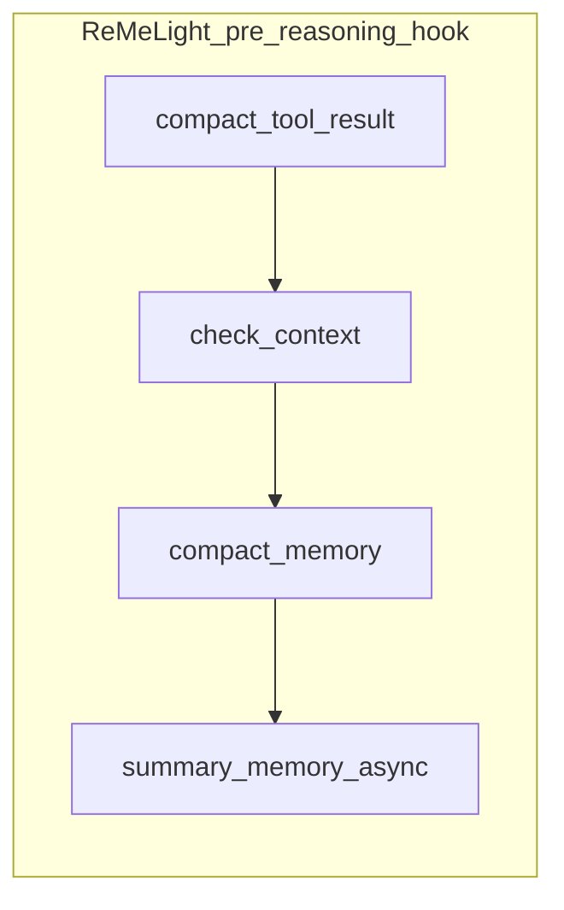
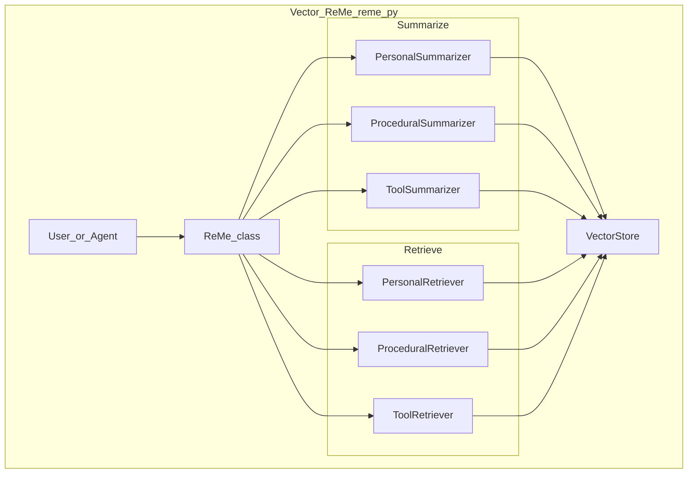

# ReMe（AgentScope）：论文「经验池–复用–精炼」与开源「ReMeLight / 向量 ReMe / benchmark」多轨交付

> **非规范文档。** 本文是外部项目调研，**不定义** EvoPalantir / `rag_design` / `knowledge/` 的正式行为。涉及本仓库的段落仅为 **观察**，不构成设计决策；正式采纳须经评审。

---

## 元数据（必填）

| 字段 | 填写 |
|------|------|
| **日期** | 2026-03-28 |
| **作者/角色** | gpr（调研） |
| **原项目** | *Remember Me, Refine Me: A Dynamic Procedural Memory Framework for Experience-Driven Agent Evolution* · [arXiv:2512.10696](https://arxiv.org/abs/2512.10696)（HTML v1 用于 §3 节标题与机制叙事） |
| **仓库 URL** | https://github.com/agentscope-ai/ReMe |
| **基线 commit（强制）** | `37628ba524c9c06a2ad2c21445c8c835a42e4418`（2026-03-28 `git -c http.proxy= -c https.proxy= ls-remote … HEAD`） |
| **检索与阅读记录（强制）** | 下列均针对 **本基线 SHA**，并与 GitHub **`git/trees/…?recursive=1` API** 抽样核对路径存在性：① 仓库根 `README.md` **全文**（ReMeLight 目录树、能力表、`pre_reasoning_hook` 执行顺序、向量记忆系统、LoCoMo/HaluMem 表、「Procedural memory paper」与 AppWorld/BFCL 子节）；② 论文 arXiv **HTML v1**（https://arxiv.org/html/2512.10696v1）：**Abstract**、**§1 Introduction**、**§3 Methodology**（§3.1–§3.4 标题与叙事）、**§4.1 Experimental Settings** 中实现细节段（**未** 通读附录证明全文）；③ `benchmark/appworld/quickstart.md`、`benchmark/bfcl/quickstart.md` **全文**；④ `reme/memory/file_based/tools/memory_search.py` 中 **`MemorySearch`** 构造函数默认值（混合检索权重锚点）；⑤ `docs/README_0_2_x.md` **未读**，仅知根 README 指向旧版文档路径。 |

**基线 commit 直链：**  
https://github.com/agentscope-ai/ReMe/tree/37628ba524c9c06a2ad2c21445c8c835a42e4418

**基线 tree API（递归，`truncated` 以 API 返回为准）：**  
`https://api.github.com/repos/agentscope-ai/ReMe/git/trees/37628ba524c9c06a2ad2c21445c8c835a42e4418?recursive=1`

---

## 一句话结论

**论文 ReMe** 将程序性记忆写成 **经验池（向量库）** 上的 **三阶段闭环**：**经验获取**（多视角轨迹蒸馏 + 校验 + 去重）、**经验复用**（嵌入检索 top-K + 可选 rerank + **rewriting**）、**经验精炼**（选择性加入 vs 全量加入、**failure-aware reflection**、**效用阈值删除** 式 (1)）。**同一 GitHub 组织下的开源仓库** 同时交付：**ReMeLight**（长对话 **Markdown 文件记忆** + `pre_reasoning_hook` 压缩链 + **hybrid_search**）、**向量 `ReMe`**（`reme/reme.py`，Personal/Procedural/Tool 三路摘要与 CRUD）、以及 **README「Procedural memory paper」** 挂载的 **`benchmark/appworld` / `benchmark/bfcl`**（`reme2` HTTP 服务、`run_*.py` 实验脚本）。三者为 **同品牌、不同产品面**：对标论文实现应 **以 benchmark 脚本 + 服务化 ReMe 为准**，**不可** 用 ReMeLight 单轨替代论文全集。

---

## 1. 问题域

Agent 记忆若 **被动追加**，会沦为静态档案；需要 **写入–检索–适配–淘汰** 的闭环。论文明确针对 **「passive accumulation」**（arXiv HTML Abstract、§1）。

与 EvoPalantir 关联：[校正记忆引擎宪章](../plans/2026-03-28-调研与设计-校正记忆与经验库.md) **GovernanceModule**（去重、合并、效用、剪枝、rule book）与 [现实对齐模拟方案](../../../knowledge/基于%20EvoPalantir%20的现实对齐模拟方案.md) §4.8–4.12「记录–检索–治理」**可对读**（仅关联，非等价实现）。

---

## 2. 对象界定

**三轨（避免混名）**

| 轨 | 锚点 | 一句话 |
|----|------|--------|
| **A. 论文 ReMe** | arXiv HTML §3–§4 | 面向 **BFCL-V3 / AppWorld** 的 **经验池 + 复用 + 精炼**；摘要声称 **Qwen3-8B + ReMe** 可优于更大无记忆模型（**未独立复现**）。 |
| **B. ReMeLight** | 根 `README.md`「File-based memory system」 | **working_dir** 下 `MEMORY.md`、`memory/*.md`、`dialog/*.jsonl`、`tool_result/*`；**上下文压缩、摘要落盘、混合检索**。 |
| **C. 向量 `ReMe` + benchmark** | `README.md`「Vector-based」+「Procedural memory paper」+ `benchmark/*` | **`ReMe` 类**（`reme/reme.py`）管理 Personal/Procedural/Tool 记忆；**AppWorld/BFCL** 经 **`reme2` HTTP** 与 `run_appworld.py` / `run_bfcl.py` 等脚本对接（见各 `quickstart.md`）。 |

**不是什么**

- **不是** 单一「RAG 包」：至少包含 **对话侧文件记忆** 与 **向量经验库** 两条主线。
- **不是** EvoPalantir CME：无 `CaseRecord` / `RetrievalPack` 契约；存储与治理语义 **需另映射**。

**与 AgentEvolver（交叉引用，不展开）**  
训练编排侧将 ReMe 作为 **可选 HTTP 经验后端** 与 Experience Manager 协同，见 [AgentEvolver 参考](./2026-03-29-agentevolver-self-evolving-training.md) 元数据与 §3.2；**不得** 据此推断 EvoPalantir 需内置 ReMe。

**与源笔记对齐**  
[自进化Agent…](../自进化Agent：经验写回的运行时记忆闭环机制/自进化Agent：经验写回的运行时记忆闭环机制.md) §二.3 的「获取–复用–精炼」与 **论文 §3 叙事** 更接近；若只读 README 的 ReMeLight 段落，易 **低估** benchmark / `reme2` 轨——属 **对象界定风险**。

---

## 3. 机制拆解（事实陈述）

### 3.0 架构总览

**ReMeLight：`pre_reasoning_hook` 执行顺序**（根 README「Execution flow」；与下图一致）



**向量 ReMe：README「Technical architecture」mermaid 的代码化缩写**（`reme/reme.py` 为入口类）



**树内对应实现路径（基线 SHA）：** `reme/memory/vector_based/personal/`、`procedural/`、`tool_call/` 下各有 `*_summarizer.py`、`*_retriever.py`（详见 §5.2）。

### 3.1 论文机制（arXiv HTML §3.1–§3.4；公式仅叙事）

- **§3.1 总览：** 三阶段 **acquisition → reuse → refinement**；与 Figure 2 一致（经验池构建、对新任务召回重组、执行后选择性更新）（HTML §3.1）。
- **§3.2 经验获取：** 经验表示 **E = ⟨ω, e, κ, c, τ⟩**（使用场景 ω、内容、关键词、置信度、工具集合）；对每任务采样 **N 条轨迹**；`LLM_summ` 做 **成功模式 / 失败分析 / 对比分析**；**LLM-as-a-Judge 校验**；**相似度去重**；按 **ω 的嵌入** 存入向量库（**experience pool**）（HTML §3.2）。
- **§3.3 经验复用：** 嵌入 **top-K** 检索；可选 **`LLM_rerank`**；**rewriting** 模块把多条经验 **重组** 为贴合当前任务的指导（HTML §3.3）。
- **§3.4 经验精炼：** **full addition vs selective addition**（实时执行中偏向 **仅成功轨迹** 入库）；**failure-aware reflection**（失败分析后最多 **3** 次自反思试错）；**效用删除** 规则：记录检索次数 **f** 与成功贡献计数 **u**，当 **f ≥ α** 且 **u/f ≤ β** 时删除（式 (1) 叙事）（HTML §3.4）。
- **§4.1 实现细节（摘录，非附录全文）：** 体验采样 **N=8**、reuse **top-K=5**；精炼阈值 **α=5**、**β=0.5**；**ReMe (fixed) vs (dynamic)** 对应经验池是否在执行中 **动态更新**（HTML §4.1 段落叙事）。

**未读显式范围：** 附录 **C.1/C.2** 提示词全文、**Table 9** 判据模板、**§4.3 以后** 消融细节仅扫标题，**未** 逐表核对数值与仓库脚本默认值是否一致。

### 3.2 ReMeLight（根 `README.md`）

**目录布局（摘录）**

```
working_dir/
├── MEMORY.md
├── memory/YYYY-MM-DD.md
├── dialog/YYYY-MM-DD.jsonl
└── tool_result/<uuid>.txt
```

**能力与主类（README 表格归纳）**

| 方法（API） | 角色 | README 指向组件 |
|-------------|------|-------------------|
| `check_context` | Token 阈值、消息切分 | `ContextChecker` → `reme/memory/file_based/components/context_checker.py` |
| `compact_memory` | 历史压成结构化摘要 | `Compactor` → `…/compactor.py` |
| `compact_tool_result` | 长工具输出外置 | `ToolResultCompactor` → `…/tool_result_compactor.py` |
| `summary_memory` | 摘要写入 `memory/*.md` | `Summarizer` + **File tools** → `…/summarizer.py`、`tools/file_io.py` |
| `memory_search` | 混合检索 | `MemorySearch` → `…/tools/memory_search.py` |
| `get_in_memory_memory` | 会话内记忆 | `ReMeInMemoryMemory` → `…/reme_in_memory_memory.py` |
| `pre_reasoning_hook` | 上述链路的编排入口 | README：`compact_tool_result` + `check_context` + `compact_memory` + `summary_memory`（异步） |

**环境变量（键名摘录，无值）**  
`LLM_API_KEY`、`LLM_BASE_URL`、`EMBEDDING_API_KEY`、`EMBEDDING_BASE_URL`（README 表格）。

### 3.3 向量 `ReMe`（`reme/reme.py`，根 README）

- **三类记忆：** Personal（偏好习惯）、Procedural（任务成败模式）、Tool（工具使用经验）（README 表格）。
- **方法面：** `summarize_memory`、`retrieve_memory`、`add_memory`、`get_memory`、`update_memory`、`delete_memory`、`list_memory`（及注释中的 `delete_all`）（README 代码示例）。
- **向量后端（README 示例字面）：** `default_vector_store_config.backend` 可取 **`local` / `chroma` / `qdrant` / `elasticsearch`**（以运行时配置为准）。

### 3.4 论文复现轨：`benchmark/appworld` 与 `benchmark/bfcl`

**共同元素（quickstart 原文归纳）**

- 启动 **`reme2`** HTTP 服务（示例中 `http.port=8002`，嵌入与向量库集合名随场景变化）。
- **AppWorld：** conda 分环境（benchmark 内 `appworld-env` vs 仓库根 `reme-env`）；`pip install appworld`、`appworld install/download`；`python run_appworld.py`；`run_exp_statistic.py` 汇总 **`exp_result/`**；脚本参数含 **`use_memory`**、**`use_memory_addition`**、**`use_memory_deletion`**（对应选择性加入 / 效用删除开关语义）、**`num_trials`**（与 failure-aware 反思相关）。
- **BFCL：** 依赖 **`gorilla` 仓库 checkout `ea13468`**、`pip install -e .`、数据预处理与 **`split_into_trainval.py`**；可先 **无记忆** 跑轨迹再 **`init_task_memory_pool.py`** 建池；**`curl` `dump_memory` / `load_memory`** 与 `./library/bfcl.jsonl` 交换经验库。

**README「Procedural memory paper」表格 vs 论文 Table 1**  
根 README 给出 **w/o vs w/ ReMe** 的 **Avg@4 / Pass@4** 提升百分比（Qwen3-8B）；**论文 Table 1** 报告 **多基线 + 标准差 + ReMe (fixed/dynamic)**。**二者来源层级不同**——引用数字时须 **标明出自 README 自述还是论文表 1**；**均未在本环境复现**。

**AppWorld 环境免责声明（README 原意转述）**  
README 写明当前实验使用 **internal AppWorld**，**可能与公开版略有差异**——对外部复现 **需降预期**。

### 3.5 产品评测自述：LoCoMo 与 HaluMem（根 README）

README 在 **「Experimental results」** 下给出 **LoCoMo**、**HaluMem** 排行榜式表格，评估协议描述为 **LLM-as-a-Judge（自述对齐 MemOS）**。该组结果 **服务于「向量/ReMeLight 产品」叙事**，与 **§3.4 论文基准轨** **不应混为同一实验合同**。

### 3.6 混合检索权重（ReMeLight）

- **README 表述：** **`memory_search` — 向量 0.7 + BM25 0.3**。
- **代码锚点：** `MemorySearch.__init__` 默认 **`vector_weight: float = 0.7`**（`reme/memory/file_based/tools/memory_search.py`），检索调用 **`file_store.hybrid_search(..., vector_weight=self.vector_weight, ...)`**；BM25 权重由 **1 − vector_weight** 在 store 内组合（**未在本文对 `file_store` 实现做行级核对**）。

---

## 4. 与 EvoPalantir 既定设计的对比（事实对齐）

| 维度 | 外部方案 | 本仓库（出处） |
|------|----------|----------------|
| 生命周期 | 论文：获取–复用–精炼；含 **效用删除** 式 (1) | Governance：**异步** 去重、合并、效用、剪枝、rule book（宪章 §1.2、§1.4） |
| 产品分裂 | **ReMeLight 对话压缩** vs **`reme2`+benchmark 经验池** vs **向量 CRUD `ReMe`** | CME：**单一 `CaseRecord` 契约** + 可选索引（宪章 §1.4） |
| 复用形态 | 论文：**rerank + rewriting**；ReMeLight：**检索片段注入** | `RetrievalPack` **结构化交付**（宪章 §2.1） |
| 时序类比（非等价） | Agent **同步 `pre_reasoning_hook`** 在推理前压缩 | CME **治理异步、不阻塞 tick**（宪章 §1.2）——仅 **对照问题意识** |
| 绑定栈 | AgentScope / CoPaw / `reme2` CLI | EvoPalantir **不假设** 上述栈为内置依赖 |

---

## 5. 重要源码坐标（基线 `37628ba…`）

### 5.1 文档（基线 tree 已核对存在）

| 主题 | 路径 | 备注 |
|------|------|------|
| 总览与双产品说明 | `README.md` | ReMeLight + 向量 ReMe + 论文小节 + LoCoMo/HaluMem |
| 旧版说明入口 | `docs/README_0_2_x.md` | 根 README 指向「0.2.x documentation」 |
| AppWorld 实验指南 | `benchmark/appworld/quickstart.md` | conda、`reme2`、`run_appworld.py` |
| BFCL 实验指南 | `benchmark/bfcl/quickstart.md` | gorilla 版本固定、`init_task_memory_pool.py`、`curl` API |

### 5.2 代码与脚本（基线 tree 已核对存在）

| 主题 | 路径 | 备注 |
|------|------|------|
| ReMeLight 入口 | `reme/reme_light.py` | README 核心类 |
| 向量 ReMe 入口 | `reme/reme.py` | README「Vector Based ReMe」 |
| File-based 组件 | `reme/memory/file_based/components/context_checker.py`、`compactor.py`、`summarizer.py`、`tool_result_compactor.py` | 与 §3.2 表对应 |
| File-based 工具 | `reme/memory/file_based/tools/memory_search.py`、`file_io.py` | `MemorySearch`、`hybrid_search` |
| 会话内存 | `reme/memory/file_based/reme_in_memory_memory.py` | `get_in_memory_memory` |
| 向量摘要/检索子模块 | `reme/memory/vector_based/personal/`、`procedural/`、`tool_call/`、`reme_summarizer.py` 等 | 与 §3.0 mermaid 对应 |
| ReMeLight 测试 | `tests/light/test_reme_light.py` | README 示例入口 |
| AppWorld 运行脚本 | `benchmark/appworld/run_appworld.py`、`run_exp_statistic.py` | quickstart |
| BFCL 运行脚本 | `benchmark/bfcl/run_bfcl.py`、`init_task_memory_pool.py`、`preprocess.py`、`split_into_trainval.py`、`run_exp_statistic.py` | quickstart |

---

## 6. 文档 vs 源码/论文差异（已核对范围内）

1. **同名「ReMe」多义：** 论文框架（§3）≠ ReMeLight 文件记忆 ≠ `reme2` HTTP 实验轨；引用时必须 **标明轨**（见 §2）。  
2. **arXiv 摘要数据集链接：** abs 页将代码/数据写成 **Markdown 断裂形式**（`[this http URL](http://reme.library/)` 类占位）；**不得以可点击性推断数据集真实 URL**——以 **论文 PDF/HTML 正式版本** 或作者后续更正为准。  
3. **BFCL quickstart 安装指引：** 文中链到 `…/blob/main/doc/README.md`；基线 tree 下可见 **`docs/`** 与 **`docs/README_0_2_x.md`**，**未见** `doc/README.md`——若 404，应以 **仓库实际文档路径** 或根 `README.md` 为准。  
4. **README AppWorld 表格 vs 论文 Table 1：** 数值与 **不确定性表述（标准差、fixed/dynamic）** **不全一致**；**禁止**混贴。  
5. **internal AppWorld：** README **免责声明**——复现与公开 leaderboard **不可无脑对齐**。  
6. **混合检索 0.7/0.3：** README 与 **`MemorySearch(vector_weight=0.7)`** **一致**；**`hybrid_search` 内部是否严格 BM25 占比 0.3** 依赖 `file_store` 实现（**未在本文行级核对**）。  
7. **未核对范围（显式）：** `reme2` CLI 实现与 **HTTP API** 全表；`run_appworld.py` / `run_bfcl.py` 与论文 **α, β, N, K** 的 **默认值是否逐项相等**；论文 **附录 C/D** 全文。

---

## 7. 观察：对校正记忆（CME）的启示

> **非规范性观察。** 不构成设计决策；采纳须经 spec/评审。

### 7.1 可借鉴

- **§3.4 选择性加入 + 效用删除 + 失败反思** 与 Governance **质量门槛、淘汰、低价值案例不入库** 可对照；**阈值 α/β** 仅为论文设定，**非** CME 默认。  
- **ReMeLight 的 `compact_tool_result` + 文件引用** 与「大 artifact **外置**、索引只持引用」的工程折衷 **可类比** Case 附件策略。  
- **`MemorySearch` 的 `vector_weight`** 与 **混合检索** 可作为 **Index/Retrieve 工程调参** 的文献外参考（宪章不规定具体权重）。

### 7.2 应保持的差异化（不盲从）

- **不得** 用 **对话日记 + Markdown** 替代 **`CaseRecord` 字段契约** 与 **MLflow Run 留痕** 分工（宪章 §1.2）。  
- **`reme2` / AppWorld 训练闭环** 的延迟与资源假设 **不可** 直接映射到 **校正 tick SLA**。

### 7.3 明确不做

- 不在 EvoPalantir 引入 **AgentScope / reme2** 为硬依赖；不把 **未核对** 的附录提示词 **写入内部 spec**。

---

## 8. 参考来源

- 论文：[arXiv:2512.10696](https://arxiv.org/abs/2512.10696) · PDF：https://arxiv.org/pdf/2512.10696 · HTML v1：https://arxiv.org/html/2512.10696v1  
- 仓库（基线）：https://github.com/agentscope-ai/ReMe/tree/37628ba524c9c06a2ad2c21445c8c835a42e4418  
- 训练编排交叉阅读：[AgentEvolver 参考](./2026-03-29-agentevolver-self-evolving-training.md)  
- 源笔记：[自进化Agent…](../自进化Agent：经验写回的运行时记忆闭环机制/自进化Agent：经验写回的运行时记忆闭环机制.md) §二.3  
- 二手综述登记：[2026-03-29-zhihu-csdn-memory-loop-survey-sources.md](./2026-03-29-zhihu-csdn-memory-loop-survey-sources.md)
