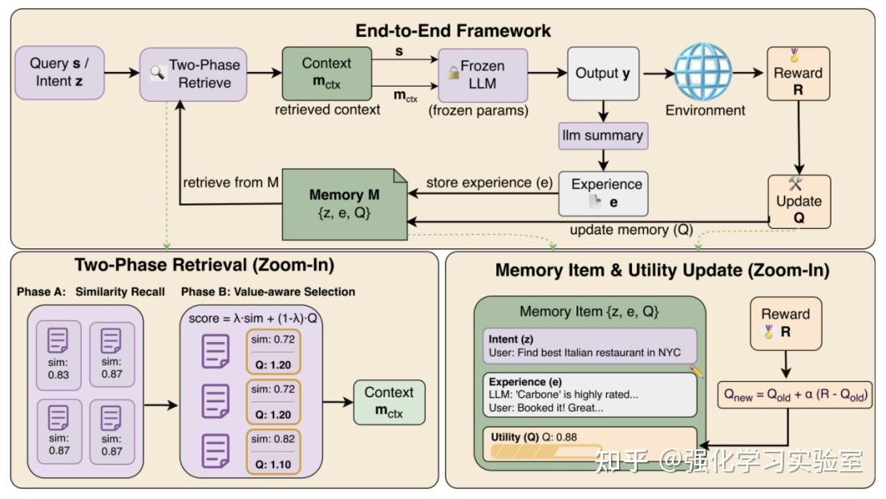

# 自进化Agent：经验写回的运行时记忆闭环机制

网页链接：前4个框架：https://zhuanlan.zhihu.com/p/1997084002595643796

第5个框架：https://zhuanlan.zhihu.com/p/1930700013954113773
第6个框架：https://modelscope.csdn.net/6923d4bd0e4c466a32ea8cce.html

# 一、文章介绍

这篇文章围绕一个核心问题展开：

> **在不更新大模型参数的情况下，Agent 能否依靠外部记忆实现持续进化？**
> 

文章认为，传统微调虽然能把经验写进参数，但成本高、容易遗忘；而普通 RAG/外部记忆虽然轻量，却常常只按“语义相似”检索，容易把无用甚至有害的经验也召回出来。

因此，真正关键的不只是“存经验”，而是让记忆形成一个**运行时闭环**：能够在执行后根据反馈持续更新、提炼、筛选和复用经验。

围绕这个思路，文章介绍了 4 个代表性框架：

- **MEMRL**：关注的是**如何从记忆库里选出真正有用的经验**。它把记忆检索从“语义相似匹配”改造成“价值驱动选择”，让智能体根据历史反馈优先调用高效用经验。
- **ReasoningBank**：关注的是**如何把一次次成功或失败经历提炼成可迁移的推理策略**。它不是简单存轨迹，而是把经验抽象成可复用的策略记忆，服务后续任务。
- **ReMe**：关注的是**记忆如何在长期运行中保持高质量**。它进一步把问题推进到记忆治理层面，不只写入经验，还会做验证、融合、精炼和剪枝，避免记忆库越积越乱。
- **MACLA**：关注的是**如何把经验上升为可复用的程序化技能**。相比前几种主要处理文本经验，它更强调把交互过程沉淀为层级化的技能程序，让智能体不仅“记住经验”，还“记住怎么做”。

# 二、4种框架介绍

## 1. MEMRL**：基于记忆效用的强化学习策略**

**核心思想**：

MEMRL 关注的是如何从记忆库中选出真正有用的经验，而不只是检索语义上相似的内容。

**机制特点**：

- **意图-经验-效用三元组**：将记忆组织为“Intent–Experience–Utility”结构。Intent 表示任务意图，Experience 表示对应经验，Utility 表示该经验在类似情境下的历史回报，因此每条记忆都带有一个可更新的价值评价。
- 检索分两步：
    - 先按语义相似召回候选
    - 再按效用值选最值得用的记忆（引入一个组合评分函数，**综合考虑语义相似度和效用值**）
    
    
    
- **运行时Q值更新**：任务完成后，根据成功或失败反馈更新被调用记忆的 Q 值，使高价值经验不断强化、低价值经验逐渐弱化。

**闭环方式**：

检索 → 执行 → 得到奖励 → 更新记忆效用

**特点总结**：

MEMRL 的重点是让 Agent 学会“**什么经验更值得调用**”。

## 2. ReasoningBank**：跨任务可迁移的推理记忆库**

**核心思想**：

ReasoningBank 关注的是如何把任务中的成功和失败经历提炼成可迁移的推理策略，而不只是存储原始轨迹。

**机制特点**：

- **策略化记忆表示**：每条记忆由标题+场景描述+内容组成，用来概括某类任务中可复用的推理方法。
- **成功与失败双重提炼**：成功经验用于总结有效策略，失败经验用于提炼失效原因和避坑规则。
- **检索—执行—提炼闭环**：新任务先检索相关策略记忆辅助推理，任务结束后再将本轮经验总结为新的策略写回记忆库。

**闭环方式**：

检索策略 → 执行任务 → 提炼成功/失败经验 → 写回记忆库

**特点总结**：

ReasoningBank 的重点是让 Agent 学会“**把经验抽象成可复用策略**”。

## 3. ReMe**：记忆蒸馏-复用-剪枝的三段式自进化**

**核心思想**：

ReMe 关注的是如何让记忆在长期运行中持续保持高质量，不只是不断写入新经验，还要对已有记忆进行验证、融合、精炼和剪枝，使记忆库能够边用边优化。

**机制特点**：

- 包含三个环节：
    - **经验获取**：先从历史任务或交互轨迹中提取经验，既包括成功案例，也包括失败案例。ReMe 不会把整段轨迹原样存下来，而是重点抽取那些真正影响结果的关键决策点，再通过验证、去重等方式筛掉低质量或重复经验。
    - **经验复用**：当新任务到来时，系统先从经验池中检索相关经验，再结合当前任务约束进行重排和改写，把原本分散的经验整理成更适合当前情境的操作性指导，注入到推理过程中。
    - **经验精炼/剪枝**：任务完成后，系统不会无差别追加新记忆，而是根据经验实际使用效果进行治理：高价值经验会被保留和融合，低效、过时或误导性的经验则会被删除或修正，从而让记忆库在长期运行中保持质量。
- 新经验不会直接存入，而是要经过：
    - 抽取
    - 验证
    - 去重
    - 融合
- 还会记录每条经验的使用效果，低效经验会被删除

**闭环方式**：

获取经验 → 检索复用 → 评估效果 → 精炼/删除/更新

**特点总结**：

ReMe 的重点是让 Agent 学会“**如何长期维护高质量记忆库**”。

## 4. MACLA**：冻结LLM下的层次程序记忆与贝叶斯精炼**

**核心思想**：

MACLA 关注的是如何将任务经验沉淀为可复用的程序化技能，让智能体不仅“记住经验”，还能够“记住怎么做”，从而在后续任务中进行更稳定的技能复用。

**机制特点**：

- **Bayesian效用选择**：为每个程序维护基于成功率更新的 **Beta 贝叶斯后验**，综合语境相关性、成功概率和失败风险，选择当前最合适的技能。
- **对比式精炼**：对比程序在成功与失败情境下的表现，修正前置条件、步骤顺序和后置条件，逐步明确程序的适用边界。
- **在线记忆生长**：从任务轨迹中持续提炼新的子程序写入记忆，并将高频共现的程序序列进一步抽象为更高层的 **playbook**。

**闭环方式**：

检索技能 → 贝叶斯选择 → 执行 → 成败反馈 → 更新/精炼程序

**特点总结**：

MACLA 的重点是让 Agent 学会“**沉淀可复用的技能程序**”。

## 5.AgentRR：经验记录与规控重放框架

**核心思想**：

AgentRR 关注的是如何把一次成功实践沉淀为可复用经验，并在后续任务中通过受约束的重放机制实现更可靠、更低成本的执行。

**机制特点**：

- **Record–Summary–Replay 三阶段框架**：先记录人类或模型的成功执行轨迹，再将轨迹总结为可复用经验，最后在新任务中进行重放。
- **多层次经验表示**：同时保留高层次经验和低层次经验。高层次经验描述任务流程与逻辑，低层次经验保留更具体的操作序列，从而兼顾泛化性与执行稳定性。
- **检查函数约束执行**：在重放过程中，通过检查函数验证状态前置条件、参数约束和执行流完整性，防止智能体偏离已验证的安全路径。
- **灵活的记录—重放组合**：支持“用户记录、模型重放”“大模型记录、小模型重放”等多种模式，可用于任务自动化、知识蒸馏、隐私保护和安全执行。

**特点总结**：

AgentRR 的核心是把经验从“单次轨迹”转化为“可规控重放的执行能力”，强调经验复现过程中的可靠性与可控性。

## 6. AgentEvolver：面向持续能力演化的自进化训练系统

**核心思想**：

AgentEvolver 关注的是如何让智能体从“被动接受训练”转向“主动推动自身进化”。它不再把训练看成外部提供任务、内部被动优化参数的过程，而是把任务生成、经验复用、奖励归因统一进一个自进化系统，使智能体可以持续探索环境、总结经验并优化策略。论文将它概括为一个 end-to-end 的 self-evolving training framework，核心由 **self-questioning、self-navigating、self-attributing** 三个机制构成。

**机制特点**：

- **自我任务生成（Self-Questioning）**：系统先基于环境配置和长期目标进行探索，再由 LLM 分析探索轨迹，反向合成新的任务查询，并从轨迹中抽取参考解。之后还会做语义去重与真实环境回放验证，过滤掉不可行或幻觉式任务。它解决的是“训练任务稀缺、人工构建成本高”的问题。
- **自我经验导航（Self-Navigating）**：系统把历史成功和失败轨迹提炼为结构化自然语言经验，并建立可检索经验池。新任务探索时，部分轨迹由历史经验引导，部分仍保持自由探索，以平衡利用与探索。训练时还会把经验文本从样本中剥离，避免模型机械记忆提示词，并对“受成功经验引导且收益为正”的样本施加更大权重。它解决的是“探索效率低、历史经验难沉淀”的问题。
- **自我反思归因（Self-Attributing）**：在长程任务结束后，系统调用“复盘专家”式 LLM 回看整段轨迹，对每一步动作打 GOOD/BAD 标签，形成过程层面的归因奖励；再与最终结果奖励结合，构成双通道复合奖励。随后将其转为逐步优势值，并广播到对应 token 上，通过 GRPO 进行策略优化。它解决的是“奖励稀疏、难以识别关键动作贡献”的问题。
- **模块化系统架构**：AgentEvolver 采用 service-oriented 的模块化设计，核心由 **Env Service** 和 **Context Manager** 两大支柱组成。前者负责连接外部环境、工具 API 与沙箱，后者负责多轮上下文管理和交互逻辑组织。这种设计让三大机制可以在不同环境中复用和扩展。GitHub README 将其概括为 environment compatibility、flexible context manager 和 modular & extensible architecture。
- **实验表现突出**：在 AppWorld 和 BFCL-v3 上，7B 版本的 AgentEvolver overall 平均成绩达到 **45.2%**，超过 14B 基线模型的 **29.8%**；在 14B 设置下，AgentEvolver overall 将平均成绩从基线 **29.8%** 提升到 **57.6%**。README 中的消融结果还显示，仅加入 questioning、questioning+navigating、questioning+attributing 都会带来明显增益，说明三种机制具有清晰的协同效应。

**闭环方式**：

环境探索 → 自主生成任务 → 执行与经验复用 → 复盘归因 → 优化策略 → 再进入新一轮环境探索

**特点总结**：

AgentEvolver 的重点是让 Agent 学会“**主动生成训练任务、利用经验指导探索，并把关键步骤的贡献精细归因到策略学习中**”。相比前几个更偏“外部记忆治理”的框架，它更像一个完整的**训练期自进化系统**。

# 三、对比表格

| 框架 | 核心关注点 | 记忆对象 | 闭环更新方式 | 主要特点 |
| --- | --- | --- | --- | --- |
| MEMRL | 记忆价值选择 | 意图-经验-效用三元组 | 根据任务反馈更新Q值 | 强调“检索有用经验” |
| ReasoningBank | 推理策略提炼 | 标题+场景+内容的策略记忆 | 对成功/失败轨迹进行总结并写回 | 强调“经验抽象成策略” |
| ReMe | 记忆治理 | 结构化经验条目 | 写入、融合、去重、删除 | 强调“长期维护高质量记忆” |
| MACLA | 程序化技能复用 | 程序/技能/playbook | 根据成败反馈更新可靠性并修正程序 | 强调“程序化技能的沉淀与复用” |
| AgentRR | 经验记录与规控重放 | 多层次经验 + 检查函数 | 记录轨迹、总结经验，并在新任务中受约束重放 | 强调“经验的可靠复现与受控执行” |
| AgentEvolver | 自进化训练 | 任务、经验池、步骤级归因信号、策略 | 自主生成任务、经验引导探索、过程/结果双通道奖励优化策略 | 强调“训练阶段的主动进化闭环” |