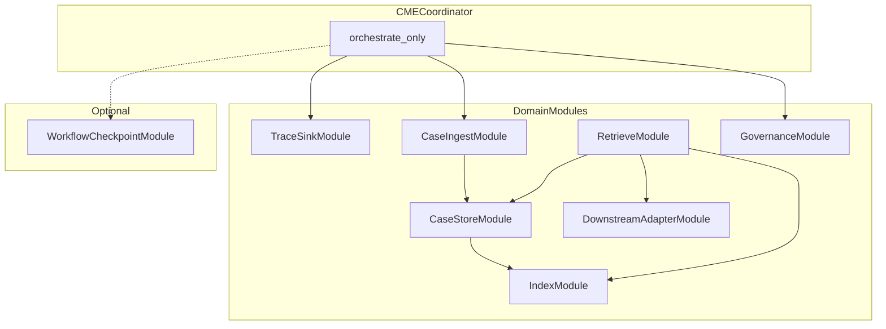
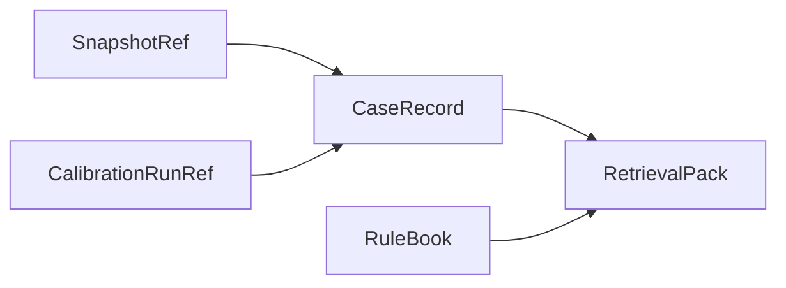

# 校正记忆引擎宪章（Calibration Memory Engine Charter）

**日期：** 2026-03-28  
**状态：** 草案 · 可迭代（成稿：`rag_design/docs/plans/2026-03-28-调研与设计-校正记忆与经验库.md`）

**权威来源：** [knowledge/基于 EvoPalantir 的现实对齐模拟方案.md](../../knowledge/基于%20EvoPalantir%20的现实对齐模拟方案.md) §4.8–4.12、§5.1 · [需求说明-校正记忆与经验库.md](../docs/需求说明-校正记忆与经验库.md) · [agentself-evolution.md](../docs/agentself-evolution.md) · [自进化Agent…](../docs/自进化Agent：经验写回的运行时记忆闭环机制/自进化Agent：经验写回的运行时记忆闭环机制.md)

**本文性质：** 定义 **单元/模块**、各模块 **采用机制**、**须实现功能**、**与外界交互**、**逻辑与规则**。实现细节（类名、仓库路径、具体 API）在 **后续实现计划** 中挂钩代码仓库。

---

## 第一章 总述

### 1.1 核心命题

仿真在 tick 推进中产生 **预测**；现实观测在快照点产生 **真值对照**。`calibration_engine` 用显式规则把模拟状态 **拉回现实**。**校正记忆引擎（Calibration Memory Engine，CME）** 负责把每一次「预测—观测—校正」变成 **可追溯、可检索、可治理** 的记录，并在 **不修改主校正逻辑** 的前提下，为 **后续推演** 与 **人读报告** 提供 **相似案例与经验摘要**。

CME **不做** 数值校正（那是 `calibration_engine`）；**不做** 仿真 tick 推进（那是 `simulation_runtime`）；**不做** 快照落盘格式定义（那是 `snapshot_service`，CME **消费** 其引用与摘要字段）。

### 1.2 全局原则

**体例声明。** 本节各条为 CME **不变量**；排版上借鉴 [Agent OS Charter](../../EPFrameWork1/docs/aos-charter.md) §1.2 的短硬命题风格（**体例对齐，域模型不等价**）。

**知识库优先。** 主数据流顺序、V1 行为边界（先记录/检索/总结，不自动改主逻辑）、MLflow 作为 V1 必选留痕载体等，**以 `knowledge/` 为准**。本文若与知识库冲突，**以知识库为真**。

**留痕与案例语义分离。** **Run 级留痕**（实验跟踪、回放索引）与 **案例级语义存储与检索** **不得混为同一概念**。V1 默认：**Run 留痕** 走 **MLflow Tracking**；**案例检索** 走 **CaseStore + Index**（结构化必选，向量索引可选）。依据见 [agentself-evolution.md](../docs/agentself-evolution.md) §1 与 §6。

**下游只认契约。** `forecast_runtime` 与 **报告管道** 只依赖 **稳定版本化的 `RetrievalPack` 契约**，不依赖 MLflow UI、不依赖 Faiss 内部结构。

**治理异步、非阻塞。** 去重、融合、剪枝、rule book 蒸馏等 **不得** 阻塞主链路 tick；默认 **异步作业** 或 **批处理**。

**可插拔存储。** TraceSink、CaseStore、VectorIndex、LLM 调用（用于反思/摘要）均通过 **接口** 接入；V1 给出 **默认实现选型**，允许替换。

**不编造外部 API。** MemOS、OpenViking 等 **仅作架构参照**；具体能力以官方文档/代码为准，本文 **不写** 未核实接口。

### 1.3 写入路径与查询路径（类比 AgentOS；非等价）

| 面 | 典型操作 | 合法入口 | 说明 |
|----|----------|----------|------|
| **写入面**（类比 AOSCP **命令**） | TraceSink.append、CaseIngest、Index.upsert、Governance.enqueue | **CMECoordinator** 管道 | 改变案例池、索引、治理队列；**不得** 将查询默认塞入同一路径 |
| **查询面**（类比 AOSCP **查询**） | Retrieve.query、CaseStore.get（调试） | **下游** 显式调用；**禁止** 以非版本化内部结构替代 **`RetrievalPack`** 主契约 | Coordinator **不在** 成功路径默认调用 Retrieve |

**脚注：** 「命令 / 查询」仅作 **读写心智模型** 对照；CME 模块边界与 Agent OS 对象 **不一一对应**。

### 1.4 模块化架构

CME 由 **薄协调器** 与 **多个职责单一的领域模块** 组成。协调器 **编排调用顺序**，**不承载** 业务规则细节。模块之间 **禁止** 绕过契约直接读写对方内部状态。

**协调器**

| 模块 | 职责 |
|------|------|
| **CMECoordinator** | 接收上游「校正完成」事件；按固定顺序调用 TraceSink、CaseIngest、Index，并 **异步触发** Governance；**不在此路径调用** Retrieve（Retrieve **仅由下游** 发起 query）；**不** 持久化自有业务状态（仅可含幂等键、请求级缓存）。 |

**领域模块**

| 模块 | 职责 |
|------|------|
| **TraceSinkModule** | 将每次校正/推演相关 run 写入 **实验跟踪**（V1 默认 MLflow）：params、metrics、artifacts 引用。 |
| **CaseIngestModule** | 把一次校正结果 **规范化** 为逻辑 `CaseRecord`；执行 **大偏差反思（Reflexion 式）** 门禁；写入 CaseStore。 |
| **CaseStoreModule** | `CaseRecord` 的 **持久化抽象**（表/文档/对象，实现可替换）。 |
| **IndexModule** | 维护 **结构化索引** 与 **可选向量索引（如 Faiss）**；供检索使用。 |
| **RetrieveModule** | **两阶段检索**（粗召回 + 精排/效用）；输出 `RetrievalPack`。 |
| **GovernanceModule** | 异步：去重、合并、效用升权/降权、**ExpeL 式 rule book** 更新；**不** 改 `calibration_engine` 代码。 |
| **DownstreamAdapterModule** | 将 `RetrievalPack` 交付 **forecast_runtime** 与 **报告生成器**（格式转换、版本字段）。 |

**可选横切模块**

| 模块 | 职责 |
|------|------|
| **WorkflowCheckpointModule**（可选） | 借鉴 LangGraph Persistence：**工作流/编排状态** 的 checkpoint、replay、debug；**明确不是** 主记忆库，**不** 替代 CaseStore。 |

### 1.5 系统总览

| 维度 | 内容 |
|------|------|
| 本体工件 | `CalibrationRunRef`、`CaseRecord`、`RetrievalPack`、`RuleBook`（逻辑） |
| 主数据流锚点 | 知识库 §4.12：`calibration_engine` → CME → `forecast_runtime` / 报告 |
| 默认机制组合 | MLflow（Trace）+ CaseStore + 结构化索引 + 可选 Faiss + 两阶段检索 + 异步治理 |
| 扩展点 | TraceSink / CaseStore / VectorIndex / SummarizerLLM 可替换；检索策略可插拔 |

---

## 第二章 世界模型

### 2.1 核心工件（逻辑定义）

以下名称 **为逻辑契约**，实现时可映射为 DB 行、JSON、MLflow run 等。

**CalibrationRunRef**  
唯一标识一次「与某次校正/推演相关的留痕 run」。与 **TraceSink** 中的 run 一一对应；**携带** `experiment_id`/`run_id` 或等价字段（依 TraceSink 实现）。

**CaseRecord**  
描述 **一次** 可复用的校正情境与结果，**至少** 应能回答：何时、何事件阶段、误差模式、用了哪些规则与超参、校正前后关键指标、关联快照引用。可选字段：`reflection_text`（大偏差时）、`embedding_ref`（向量存于索引侧时的指针）、`utility_score`（治理模块更新）。

**RetrievalPack**  
**下游唯一应依赖** 的结构化输出：版本号 `schema_version`、查询上下文摘要、`cases[]`（每条含 case_id、关键指标差分、规则摘要、可选反思摘录、来源 run 引用）、`rulebook_excerpts[]`（可选）、**免责声明字段**（「建议/非自动决策」）。

**RuleBook**  
由 Governance 维护的 **蒸馏规则条目** 集合（ExpeL 思想）：短句规则、适用条件标签、置信度或支持度；**用于辅助诊断与报告**，**不** 自动覆盖 `calibration_engine` 内联参数。

**SnapshotRef**  
来自 `snapshot_service` 的引用（id 或 URI 逻辑）；CME **不解析** 快照内部二进制格式，**只保存引用与已算好的摘要指标**（与知识库 §4.8 对齐）。

### 2.2 工件关系

### 2.3 三类可见性与持久化角色（修辞平行 AgentOS；非等价）

与 [Agent OS Charter](../../EPFrameWork1/docs/aos-charter.md) 中「会话可见 / 运行时 / 审计」分层 **修辞上可对读**，但 **以下三类不是 AOS 同名对象**，仅为 CME 侧 **可见性与真源** 划分（**体例对齐，域模型不等价**）。

| 层次 | 角色 | 典型载体 | 对下游含义 |
|------|------|----------|------------|
| **Run 留痕** | 实验与回放索引；审计与对照 | TraceSink（V1 默认 MLflow） | **不等同** 案例语义主源 |
| **Case 真源** | 可复用校正情境的 **权威存储** | CaseStore | ingest 成功后的 **事实集合** |
| **RetrievalPack 投影** | 下游消费的 **版本化视图** | Retrieve 输出 | `forecast_runtime` / 报告 **唯一应依赖** 的契约面 |

### 2.4 与知识库主数据流的锚定

固定顺序（摘录知识库 §4.12）：

`… → calibration_engine → 校正后的状态 → calibration_memory_engine → 误差经验 / 相似案例 → forecast_runtime → …`

**规则：** CME 的入口事件 **必须** 在 `calibration_engine` **成功产出校正后状态** 之后触发；**禁止** 在入口侧反向修改该校正结果。

---

## 第三章 CMECoordinator（协调器）

### 3.1 定义

编排 **单次** 「校正完成」处理流程的 **无状态（或仅幂等状态）** 组件。体例上借鉴 [Agent OS Charter](../../EPFrameWork1/docs/aos-charter.md) **薄协调器** 叙事：知顺序，不知各模块内部实现（**体例对齐，域模型不等价**）。

### 3.2 采用机制

固定 **管道顺序**（成功路径）：`TraceSink.append` → `CaseIngest.ingest` → `Index.upsert_case` → （异步）`Governance.enqueue`。**Retrieve** **不在此路径默认调用**；由 **下游** 通过 `Retrieve.query` 拉取。

### 3.3 须实现的功能

- 接收 **上游 bundle**（见 §3.4），校验 **必填字段**；缺失则 **拒绝写入** 并记录错误（写入 Runtime 日志或等价，不在本文定义）。  
- 保证 **TraceSink 与 CaseIngest 要么都成功要么可补偿**：若 Case 写入失败，须定义 **补偿策略**（例如标记 run 为 partial，实现阶段定）。  
- 向 Governance 投递 **轻量任务描述**（case_id 列表或增量游标）。

### 3.4 与外界交互

| 方向 | 对象 | 输入 | 输出 |
|------|------|------|------|
| 入 | `calibration_engine` / 其适配层 | `PostCalibrationBundle`：snapshot_ref、event_phase、pre_metrics、post_metrics、applied_rules、hyperparams、可选 prediction_snapshot | 处理完成 ack / 错误 |
| 出 | TraceSinkModule | 标准化后的 run 载荷 | CalibrationRunRef |
| 出 | CaseIngestModule | 同上 bundle + run_ref | CaseRecord |
| 出 | GovernanceModule | 任务信封 | 队列接受确认 |

**PostCalibrationBundle** 字段集合 **须与知识库 §4.8–4.9 指标口径一致**（立场分布、极化、关键节点活跃度、传播结构等）；**细表对照** 列为实现前交付物（宪章 §12.2 缺口）。

### 3.5 逻辑与规则

- **单写入口：** 业务侧 **仅通过** Coordinator 声明式 API 写入案例与 run，**禁止** 模块外直接写 CaseStore。  
- **幂等：** 同一 `snapshot_ref + correction_attempt_id`（或等价键）重复投递 **应** 幂等（更新或拒绝 duplicate，实现二选一，须在实现 spec 写死）。  
- **失败隔离：** 单条 ingest 失败 **不得** 拖垮整个仿真进程；错误路径行为在实现中定义（重试/死信）。

---

## 第四章 TraceSinkModule（Run 留痕）

### 4.1 定义

将 **一次** 校正相关活动登记为 **可追踪 run**，供 **回放索引、实验对照、人读报告** 使用。

### 4.2 采用机制

**V1 默认：MLflow Tracking**（知识库 §5.1、[agentself-evolution.md](../docs/agentself-evolution.md) §1）。通过 **TraceSink 接口** 封装，以便替换为 W&B、Neptune、自建表等。

### 4.3 须实现的功能

- 写入 **params**：场景/事件 id、seed、机制与版本签名、applied_rules 标识、hyperparams（α、λ 等）。  
- 写入 **metrics**：各观测指标预测误差、校正幅度、案例命中率（若可算）、检索调用统计（可选）。  
- 登记 **artifacts 引用**：误差日志、case JSON、`RuleBook` 导出快照、轨迹摘要文件等（**大对象走 artifact，不塞 params**）。

### 4.4 与外界交互

| 方向 | 对象 | 说明 |
|------|------|------|
| 入 | CMECoordinator | append 载荷 |
| 出 | MLflow Tracking Server（部署环境） | HTTP/API |
| 读 | 人读侧报告生成器、调试工具 | 按 run_id 查询 |

### 4.5 逻辑与规则

- **不作为主案例语义库：** **禁止** 要求下游仅用 MLflow 完成 **语义相似案例检索**；语义检索 **必须** 走 CaseStore + Index（agentself §1）。  
- **可替换：** 实现 **必须** 通过 `ITraceSink`（名称可改）抽象，**禁止** 在 RetrieveModule 内嵌 MLflow 客户端。  
- **审计：** run 与 `CaseRecord.case_id` **应可互链**（tag 或 param 字段）。

---

## 第五章 CaseIngestModule（案例摄入）

### 5.1 定义

把 PostCalibrationBundle **规范化** 为 **CaseRecord**，并执行 **反思门禁**。

### 5.2 采用机制

- **Mesa DataCollector 思想**（[agentself-evolution.md](../docs/agentself-evolution.md) §2）：字段分层（model-level / agent-level / tables）**启发** CaseRecord 的 **指标块** 组织；**不强制** 依赖 Mesa 库。  
- **Reflexion**（agentself §3）：当 **偏差超阈值** 时生成 `reflection_text` **写入 CaseRecord**。

### 5.3 须实现的功能

- 字段校验、单位与口径与知识库 **四项指标** 一致。  
- **阈值策略**：配置化「何种指标组合触发反思」；未触发时 `reflection_text` 为空。  
- 生成 **稳定 case_id**（由 snapshot_ref + phase + hash(rules) 等构成，实现 spec 定义）。

### 5.4 与外界交互

| 方向 | 对象 | 输入 | 输出 |
|------|------|------|------|
| 入 | CMECoordinator | PostCalibrationBundle、CalibrationRunRef | CaseRecord |
| 出 | CaseStoreModule | CaseRecord | 持久化 ack |
| 出 | SummarizerLLM（可选） | 偏差上下文 | reflection 文本 |

### 5.5 逻辑与规则

- **反思不改状态：** `reflection_text` **仅** 记录与解释，**不** 自动回写 `calibration_engine` 参数。  
- **隐私：** 是否把原始观测文本写入 CaseRecord **遵循** 需求说明与团队合规决策；宪章 **不预决**（见 §12.3）。

---

## 第六章 CaseStoreModule（案例持久化）

### 6.1 定义

`CaseRecord` 的 **唯一正式持久化边界**（体例上可对照 AOS 中 Store 边界思想；**体例对齐，域模型不等价**）。

### 6.2 采用机制

逻辑上 **关系表或文档库** 均可；**必须** 支持按 case_id 读写与批量列举。

### 6.3 须实现的功能

CRUD：**put**、**get**、**batch_list**（供 Governance 与报告）；**乐观锁或版本字段**（防治理与写入竞态，实现选一种）。

### 6.4 与外界交互

| 方向 | 对象 |
|------|------|
| 入 | CaseIngestModule、GovernanceModule（更新 utility、合并标记） |
| 出 | IndexModule（读 case 特征）、RetrieveModule |

### 6.5 逻辑与规则

- **禁止** RetrieveModule 绕过 CaseStore 直接读原始 Trace 当案例主源（调试模式可例外，须显式 flag）。  
- **保留策略：** 留存时长、归档 **由运维策略决定**，不在宪章写死。

---

## 第七章 IndexModule（索引）

### 7.1 定义

为 CaseRecord 提供 **结构化检索键** 与 **可选向量近邻**。

### 7.2 采用机制

- **结构化：** 事件类型、阶段、误差模式标签、指标区间（与知识库「按事件类型、阶段、误差模式做经验归档」一致）。  
- **向量（可选）：Faiss**（agentself §6）或等价服务；**嵌入模型** 选型为 **缺口**（§12.2）。

### 7.3 须实现的功能

- `upsert_case(case_id, structured_features, optional_embedding)`  
- `filter_query(structured_predicate) -> candidate_ids`  
- `vector_query(embedding, top_k) -> candidate_ids`（可选未配置时返回空）

### 7.4 与外界交互

| 方向 | 对象 |
|------|------|
| 入 | CaseIngest（upsert）、Governance（重索引、删除向量） |
| 出 | RetrieveModule |

### 7.5 逻辑与规则

- **两路召回可合并：** RetrieveModule **应先** 结构化过滤 **再** 向量扩召回或反之，**顺序与加权** 在 RetrieveModule 定义，IndexModule **不** 做业务重排。  
- **索引与存储一致：** case 删除或合并后 **必须** 最终一致（异步 acceptable，须定义最大延迟 SLA 在实现 spec）。

---

## 第八章 RetrieveModule（检索）

### 8.1 定义

对当前情境输出 **`RetrievalPack`**，供推演与报告消费。

### 8.2 采用机制

- **MemRL 两阶段思想**（agentself §5 与自进化综述 MEMRL）：**粗召回** + **精排**（可用效用分、规则匹配度、时间衰减）。  
- **CBR 流程对齐**（agentself §7）：在 **系统边界** 上支持 **retrieve →（外部）adapt → revise → retain**；**adapt/revise 改变仿真或规则** 的动作 **不在** RetrieveModule 内自动执行，**须** 显式人机或上层策略（与知识库 V1 不自动改主逻辑一致）。

### 8.3 须实现的功能

- `query(QuerySpec) -> RetrievalPack`  
- `schema_version` **递增规则**（破坏性变更时 bump）  
- 精排输入 **可含** `utility_score`（来自 CaseRecord / Governance）

### 8.4 与外界交互

| 方向 | 对象 | 说明 |
|------|------|------|
| 入 | forecast_runtime、报告服务、（可选）Agent | QuerySpec |
| 入 | IndexModule、CaseStoreModule | 候选与全文 |
| 出 | DownstreamAdapterModule | 原始包 → 视图转换 |

### 8.5 逻辑与规则

- **禁止** 在检索结果中夹带 **可执行代码** 作为默认可信输出；若附带规则 JSON，**必须** 标记为 **建议**。  
- **Top-K 与多样性：** 配置化；默认 **避免** 返回高度重复案例（实现策略）。

---

## 第九章 GovernanceModule（治理）

### 9.1 定义

异步维护案例库 **质量** 与 **规则书**，对标 ReMe / ExpeL 中「蒸馏、合并、剪枝」**工程化**，**不** 等价于在线改模型参数。

### 9.2 采用机制

- **ReMe：** 去重、融合、剪枝、低效案例降权。  
- **ExpeL：** 从多条 CaseRecord 蒸馏 **RuleBook** 条目（agentself §4）。  
- **效用驱动：** 与 MemRL 效用思想一致，**更新** `utility_score`（实现：滑动平均、Elo、或简单计数，由实现 spec 定）。

### 9.3 须实现的功能

- 任务队列消费、批处理窗口、**与 Index 的同步**（删改后触发重索引）。  
- RuleBook **版本化** 与 **导出为 artifact**（供 TraceSink 关联）。

### 9.4 与外界交互

| 方向 | 对象 |
|------|------|
| 入 | CMECoordinator（enqueue）、可选定时器 |
| 出 | CaseStoreModule、IndexModule、TraceSink（导出 rule book artifact） |
| 入（可选） | SummarizerLLM（批量蒸馏） |

### 9.5 逻辑与规则

- **不得同步阻塞** Coordinator 主路径；**默认** 队列延迟可接受。  
- **RuleBook 效力：** **仅** 「辅助诊断/报告/检索特征」；**禁止** 在本模块内 **直接调用** `calibration_engine` 改 α/λ。若未来允许「建议→人工批准→应用」，**须** 新辟 **显式** 工作流，不在 V1 隐式完成。

---

## 第十章 DownstreamAdapterModule（下游适配）

### 10.1 定义

将 `RetrievalPack` 转为 **forecast_runtime** 与 **报告管道** 各自需要的 **视图**（字段子集、单位、语言模板槽位）。

### 10.2 采用机制

纯 **适配与版本协商**；可含 **缓存**（TTL 配置化）。

### 10.3 须实现的功能

- `for_forecast(pack) -> ForecastContextBlob`  
- `for_report(pack) -> ReportSectionModel`  
- **拒绝** 静默丢字段：未知 `schema_version` **须** 报错或降级策略显式记录。

### 10.4 与外界交互

| 方向 | 对象 |
|------|------|
| 入 | RetrieveModule |
| 出 | forecast_runtime、human_report 管道 |

### 10.5 逻辑与规则

- **forecast 与 report 共用** 同一 Retrieve 结果源，**禁止** 两套不一致的私有缓存（除非 TTL 与失效策略一致）。  
- **人读侧** 呈现形态（UI/导出）**在实现或产品 spec 选择**；宪章 **要求** 含 **实验对照与误差解释** 能力（需求说明 §4.1）。

---

## 第十一章 WorkflowCheckpointModule（可选）

### 11.1 定义

借鉴 **LangGraph Persistence**（agentself §8）：为 **编排/调试** 提供 **checkpoint / replay**，**不是** CaseRecord 的源库。

### 11.2 采用机制

可选启用；与 CME **弱耦合**，仅通过 **显式 hook** 写入/读取 checkpoint。

### 11.3 须实现的功能（若启用）

保存/恢复 **工作流状态机** 快照；与 `CalibrationRunRef` **可关联** 便于审计。

### 11.4 与外界交互

调试工具、编排器；**不** 对 `forecast_runtime` 做默认硬依赖。

### 11.5 逻辑与规则

- **禁止** 用 checkpoint **替代** CaseStore 满足「相似案例检索」需求。  
- **是否引入** LangGraph 或等价库 **为架构决策**（§12.2）。

---

## 第十二章 系统边界与合规

### 12.1 审计与责任边界

| 问题 | 由谁回答 |
|------|----------|
| 某次校正 **为什么** 这样调参 | TraceSink run + CaseRecord + 可选 reflection |
| 推演 **参考** 了哪些历史案例 | RetrievalPack 内引用列表 |
| 系统 **是否** 自动改了校正公式 | **否（V1）**；若未来「建议→批准→应用」须独立工作流 |

### 12.2 与外界的硬边界

- **允许逻辑描述接轨：** MemOS、OpenViking、EvoSim 等 **不作为** 本文契约的一部分。  
- **实现阶段** 再绑定：代码路径、gRPC/HTTP、事件总线格式。

### 12.3 数据与合规（规则位）

存储 Reddit 原文、用户标识或仅聚合指标 **由团队裁决**；CaseIngest 与 CaseStore **必须** 支持 **字段级脱敏策略钩子**（实现时空实现或 no-op）。

### 12.4 缺口清单（实现前闭合）

- PostCalibrationBundle ↔ 知识库 §4.8 快照字段 **对照表**。  
- MemRL（MemTensor 论文/仓库）与 自进化综述 **MEMRL** **命名与选型** 去重。  
- 嵌入模型、Faiss 参数、结构化键 **合并算法**。  
- CBR 的 adapt/revise **人机分工** 与 UI。  
- WorkflowCheckpointModule **是否部署**。

---

## 第十三章 调研映射简表（非规范正文）

| 来源 | 用途 |
|------|------|
| 自进化Agent 六框架 | 检索/治理/策略/技能化等 **思想对照**，机制已吸收进各章 |
| agentself-evolution | MLflow/Mesa/Reflexion/ExpeL/MemRL/Faiss/CBR/LangGraph **条目化借鉴** |
| 架构计划 Agent=LLM+Skills | CME 可包装为 **Stateful I/O Skill**；不展开 |

---

## 尾注

_本宪章定义校正记忆引擎内部模块、契约与规则边界。实现须遵守 `knowledge/` 与《需求说明》；存储与算法替换不得破坏 `RetrievalPack` 版本契约与「V1 不自动改主校正逻辑」红线。_
